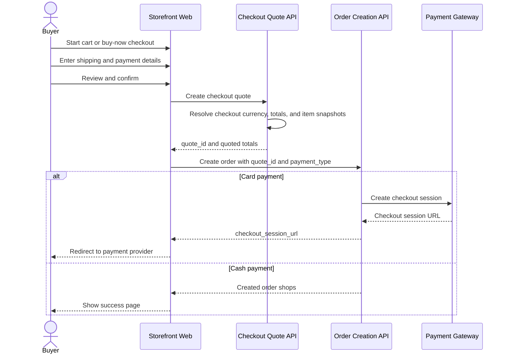
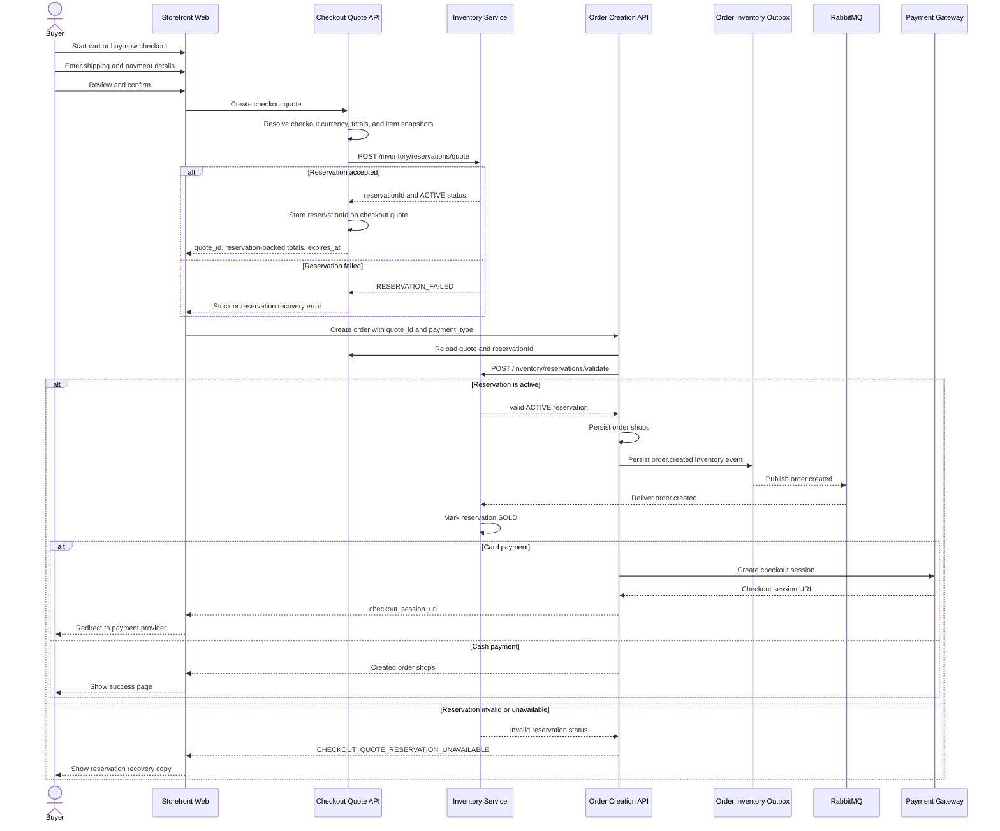

# Checkout Flow

This document is the entry point for end-to-end checkout lifecycle examples across cart checkout, buy-now checkout, buyer identity modes, payment returns, and recoverable failures.

For feature scope, user-visible states, invariants, and implementation notes, see [README.md](README.md).

## Main Flow

Summary:

- checkout has one shared boundary for cart and buy-now: the storefront creates a quote first, then creates orders from the returned `quote_id`
- checkout quote creation owns checkout currency, totals, and item snapshots
- order creation consumes `quote_id` plus `payment_type`
- card payment redirects through a payment-provider checkout session
- cash payment confirms after local order creation returns created order shops

## Main Flow With Inventory Service

Summary:

- when `INVENTORY_RESERVATION_DRIVER=remote`, checkout uses the Go `inventory-service` as the stock reservation owner
- quote creation calls `POST /inventory/reservations/quote` and stores the returned `reservationId` on the checkout quote
- order creation validates the stored reservation through `POST /inventory/reservations/validate` before persisting order shops
- NestJS records an `order.created` inventory event in the order inventory outbox after quote-backed orders are created
- the outbox publisher publishes `order.created` through RabbitMQ, and `inventory-service` consumes it to transition the reservation to `SOLD`
- if the remote reservation is missing, inactive, expired, released, or mismatched, checkout returns the reservation-unavailable recovery path

## Detailed Flows

- [Cart Checkout](flows/cart-checkout.md)
- [Buy-Now Checkout](flows/buy-now-checkout.md)
- [Authenticated Buyer](flows/authenticated-buyer.md)
- [Guest Buyer](flows/guest-buyer.md)
- [Card Payment Return](flows/card-payment-return.md)
- [Cash Payment Success](flows/cash-payment-success.md)
- [Recoverable Failure Flow](flows/recoverable-failure.md)
- [Target Async Card Checkout](flows/target-async-card-checkout.md)
