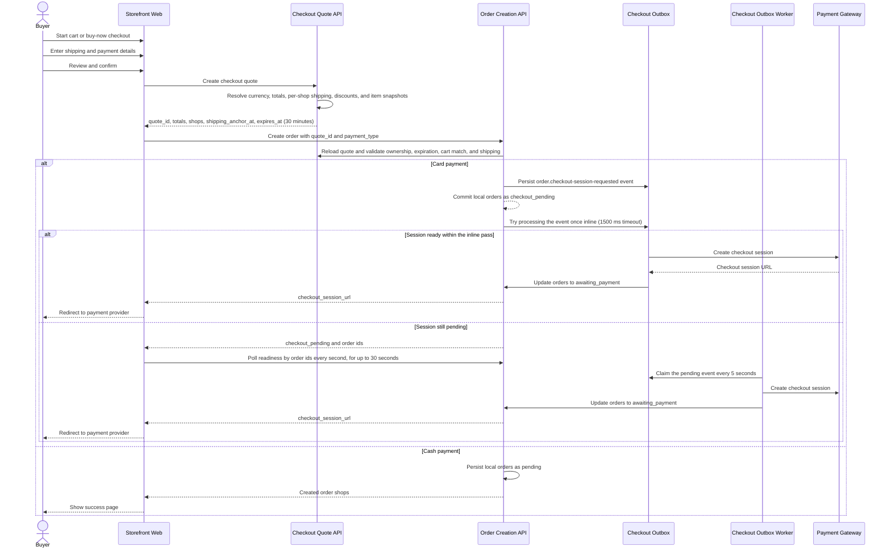
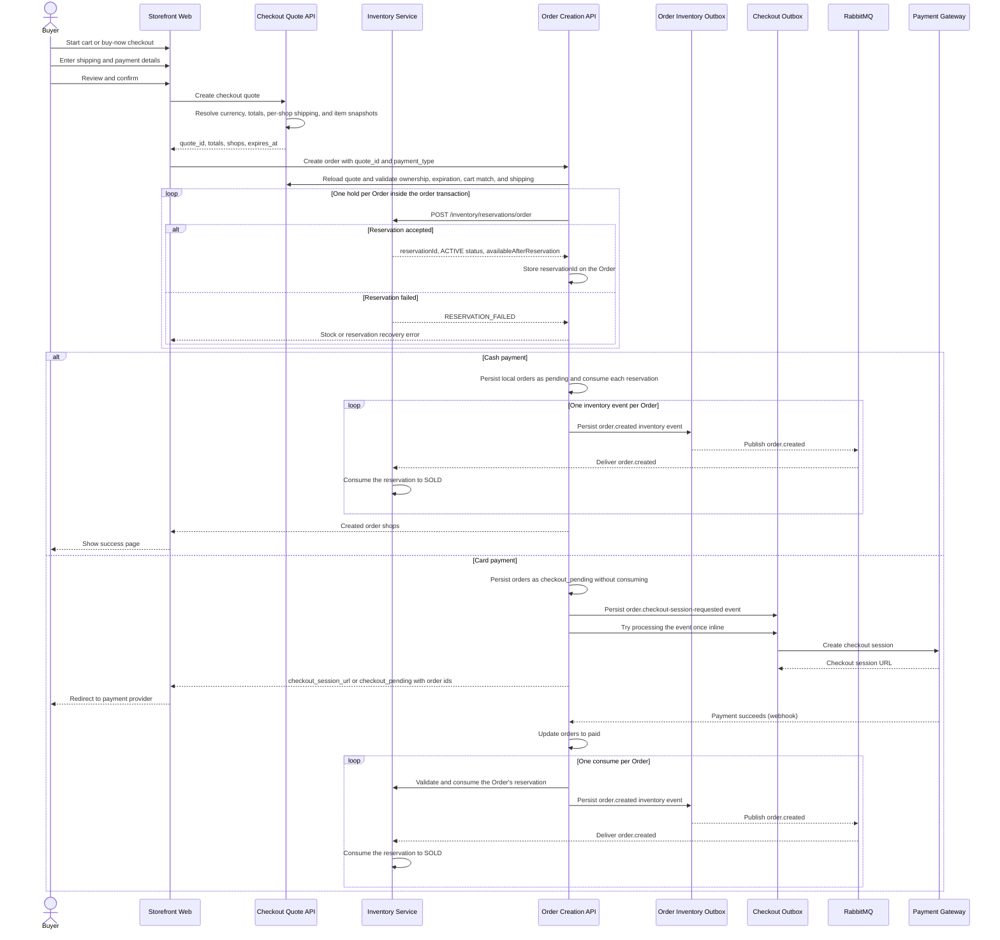

# Checkout Flow

This document is the entry point for end-to-end checkout lifecycle examples across cart checkout, buy-now checkout, buyer identity modes, payment returns, and recoverable failures.

API paths are written without the API global prefix; every checkout and order route is served under `/v1`.

## Main Flow

```mermaid
sequenceDiagram
    actor Buyer
    participant Web as Storefront Web
    participant Quote as Checkout Quote API
    participant Order as Order Creation API
    participant Outbox as Checkout Outbox
    participant Worker as Checkout Outbox Worker
    participant Payment as Payment Gateway

    Buyer->>Web: Start cart or buy-now checkout
    Buyer->>Web: Enter shipping and payment details
    Buyer->>Web: Review and confirm
    Web->>Quote: Create checkout quote
    Quote->>Quote: Resolve currency, totals, per-shop shipping, discounts, and item snapshots
    Quote-->>Web: quote_id, totals, shops, shipping_anchor_at, expires_at (30 minutes)
    Web->>Order: Create order with quote_id and payment_type
    Order->>Quote: Reload quote and validate ownership, expiration, cart match, and shipping
    alt Card payment
        Order->>Outbox: Persist order.checkout-session-requested event
        Order-->>Order: Commit local orders as checkout_pending
        Order->>Outbox: Try processing the event once inline (1500 ms timeout)
        alt Session ready within the inline pass
            Outbox->>Payment: Create checkout session
            Payment-->>Outbox: Checkout session URL
            Outbox->>Order: Update orders to awaiting_payment
            Order-->>Web: checkout_session_url
            Web-->>Buyer: Redirect to payment provider
        else Session still pending
            Order-->>Web: checkout_pending and order ids
            Web->>Order: Poll readiness by order ids every second, for up to 30 seconds
            Worker->>Outbox: Claim the pending event every 5 seconds
            Worker->>Payment: Create checkout session
            Worker->>Order: Update orders to awaiting_payment
            Order-->>Web: checkout_session_url
            Web-->>Buyer: Redirect to payment provider
        end
    else Cash payment
        Order->>Order: Persist local orders as pending
        Order-->>Web: Created order shops
        Web-->>Buyer: Show success page
    end
```

Summary:

- checkout has one shared boundary for cart and buy-now: the storefront creates a quote first, then creates orders from the returned `quote_id`
- checkout quote creation owns checkout currency, totals, per-shop shipping charge and estimate, discounts, and item snapshots; a quote expires 30 minutes after its anchor instant
- the storefront reuses an accepted quote while the cart, address, shop adjustments, and shipping fingerprint still match, and re-quotes on the review step when they change
- order creation reloads the quote and validates ownership, expiration, cart match, and shipping deliverability; accepted shipping is copied onto the orders and never repriced
- card order creation reserves one stock hold per Order without consuming it, persists orders as `checkout_pending`, writes an `order.checkout-session-requested` event in the checkout outbox in the same transaction, and attempts exactly one inline processing pass with a 1500 ms timeout
- when the session is ready inline the response carries `checkout_session_url`; otherwise the response carries `checkout_pending` with order ids, a Redis-gated worker claims pending events every 5 seconds, and an authenticated storefront polls `GET /me/checkout/session/readiness?order_ids=` every second for up to 30 seconds
- cash order creation reserves one stock hold per Order inside the same transaction, persists orders as `pending`, consumes the hold, and confirms after local order creation returns created order shops; with the default `local` driver the API consumes the reservation in that transaction, while with the `remote` driver it only checks that the reservation is `ACTIVE` and `inventory-service` consumes it when it processes `order.created`

## Main Flow With Inventory Service

```mermaid
sequenceDiagram
    actor Buyer
    participant Web as Storefront Web
    participant Quote as Checkout Quote API
    participant Inventory as Inventory Service
    participant Order as Order Creation API
    participant InventoryOutbox as Order Inventory Outbox
    participant CheckoutOutbox as Checkout Outbox
    participant RabbitMQ
    participant Payment as Payment Gateway

    Buyer->>Web: Start cart or buy-now checkout
    Buyer->>Web: Enter shipping and payment details
    Buyer->>Web: Review and confirm
    Web->>Quote: Create checkout quote
    Quote->>Quote: Resolve currency, totals, per-shop shipping, and item snapshots
    Quote-->>Web: quote_id, totals, shops, expires_at

    Web->>Order: Create order with quote_id and payment_type
    Order->>Quote: Reload quote and validate ownership, expiration, cart match, and shipping
    loop One hold per Order inside the order transaction
        Order->>Inventory: POST /inventory/reservations/order
        alt Reservation accepted
            Inventory-->>Order: reservationId, ACTIVE status, availableAfterReservation
            Order->>Order: Store reservationId on the Order
        else Reservation failed
            Inventory-->>Order: RESERVATION_FAILED
            Order-->>Web: Stock or reservation recovery error
        end
    end

    alt Cash payment
        Order->>Order: Persist local orders as pending and consume each reservation
        loop One inventory event per Order
            Order->>InventoryOutbox: Persist order.created inventory event
            InventoryOutbox-->>RabbitMQ: Publish order.created
            RabbitMQ-->>Inventory: Deliver order.created
            Inventory->>Inventory: Consume the reservation to SOLD
        end
        Order-->>Web: Created order shops
        Web-->>Buyer: Show success page
    else Card payment
        Order->>Order: Persist orders as checkout_pending without consuming
        Order->>CheckoutOutbox: Persist order.checkout-session-requested event
        Order->>CheckoutOutbox: Try processing the event once inline
        CheckoutOutbox->>Payment: Create checkout session
        Payment-->>CheckoutOutbox: Checkout session URL
        Order-->>Web: checkout_session_url or checkout_pending with order ids
        Web-->>Buyer: Redirect to payment provider
        Payment-->>Order: Payment succeeds (webhook)
        Order->>Order: Update orders to paid
        loop One consume per Order
            Order->>Inventory: Validate and consume the Order's reservation
            Order->>InventoryOutbox: Persist order.created inventory event
            InventoryOutbox-->>RabbitMQ: Publish order.created
            RabbitMQ-->>Inventory: Deliver order.created
            Inventory->>Inventory: Consume the reservation to SOLD
        end
    end
```

Summary:

- when `INVENTORY_RESERVATION_DRIVER=remote`, checkout uses the Go `inventory-service` as the stock reservation owner over HTTP; with the default `local` driver the API owns the same accounting in its own database
- checkout quote creation is a pricing and advisory-availability checkpoint; it does **not** reserve stock and does **not** own a reservation; quote reuse is based on fingerprint match and expiry
- stock is reserved at order creation, inside the order transaction: one hold is created per Order via `POST /inventory/reservations/order`; `RESERVATION_FAILED` remains the single reserve failure code and is surfaced at order creation, so a buyer can fail after reviewing because the quote no longer holds stock
- cash order creation reserves and immediately consumes the hold in the same transaction; with the default `local` driver the API consumes the reservation in that transaction, while with the `remote` driver it only checks that the reservation is `ACTIVE` and `inventory-service` consumes it to `SOLD` when it processes `order.created`
- card order creation reserves the hold but does not consume it; the hold stays active until payment resolves
- each Order owns its reservation; the `order.created` inventory outbox event is written once per Order at order creation for cash orders, and once per Order after payment success for card orders
- the inventory outbox publisher publishes `order.created` through RabbitMQ, and `inventory-service` consumes it to move the matching reservation to `SOLD`
- payment success consumes the reservation per Order; payment session expiry or abandonment releases the Order's hold through `POST /inventory/reservations/release` with reason `order_session_expired`; the delayed job `order.cleanup-expired-order-reservations` acts as the fallback release when the provider expiry webhook never arrives
- order cancellation restores a consumed sale through `POST /inventory/reservations/restore-sale`
- if the remote reservation is missing, inactive, expired, released, or mismatched, checkout returns the reservation-unavailable recovery path

## Rendered Diagrams

- [Checkout Main Flow](diagrams/checkout-main-flow.html)
- [Checkout Quote and Reservation Flow](diagrams/checkout-reservation-quote.html)
- [Cash Order and Inventory Event Flow](diagrams/checkout-order-inventory-event.html)
- [Card Payment Session Flow](diagrams/checkout-payment-session.html)
- [Checkout Reservation Lifecycle](diagrams/checkout-reservation-lifecycle.html)
- [Cart Checkout](diagrams/cart-checkout.html)
- [Buy-Now Checkout](diagrams/buy-now-checkout.html)
- [Authenticated Buyer](diagrams/authenticated-buyer.html)
- [Guest Buyer](diagrams/guest-buyer.html)
- [Recoverable Failure Flow](diagrams/recoverable-failure.html)
- [Async Card Checkout](diagrams/async-card-checkout.html)
