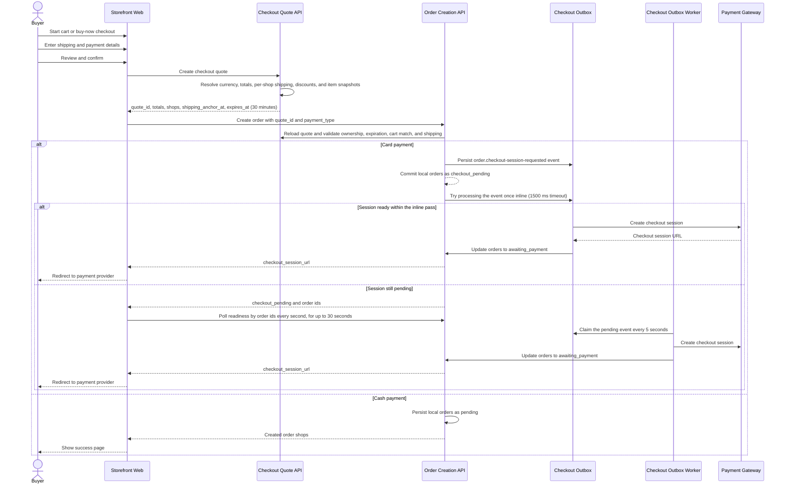
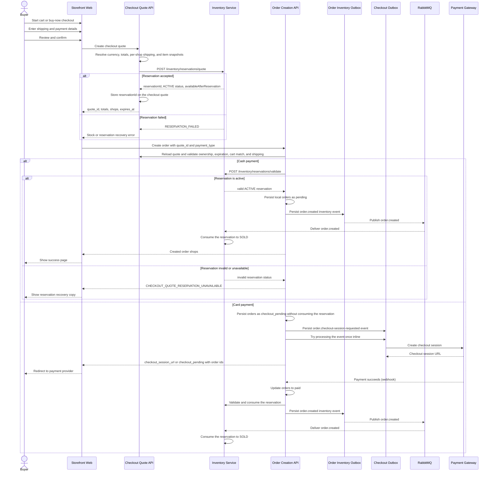

# Checkout Flow

This document is the entry point for end-to-end checkout lifecycle examples across cart checkout, buy-now checkout, buyer identity modes, payment returns, and recoverable failures.

API paths are written without the API global prefix; every checkout and order route is served under `/v1`.

## Main Flow

```mermaid
sequenceDiagram
    actor Buyer
    participant Web as Storefront Web
    participant Quote as Checkout Quote API
    participant Order as Order Creation API
    participant Outbox as Checkout Outbox
    participant Worker as Checkout Outbox Worker
    participant Payment as Payment Gateway

    Buyer->>Web: Start cart or buy-now checkout
    Buyer->>Web: Enter shipping and payment details
    Buyer->>Web: Review and confirm
    Web->>Quote: Create checkout quote
    Quote->>Quote: Resolve currency, totals, per-shop shipping, discounts, and item snapshots
    Quote-->>Web: quote_id, totals, shops, shipping_anchor_at, expires_at (30 minutes)
    Web->>Order: Create order with quote_id and payment_type
    Order->>Quote: Reload quote and validate ownership, expiration, cart match, and shipping
    alt Card payment
        Order->>Outbox: Persist order.checkout-session-requested event
        Order-->>Order: Commit local orders as checkout_pending
        Order->>Outbox: Try processing the event once inline (1500 ms timeout)
        alt Session ready within the inline pass
            Outbox->>Payment: Create checkout session
            Payment-->>Outbox: Checkout session URL
            Outbox->>Order: Update orders to awaiting_payment
            Order-->>Web: checkout_session_url
            Web-->>Buyer: Redirect to payment provider
        else Session still pending
            Order-->>Web: checkout_pending and order ids
            Web->>Order: Poll readiness by order ids every second, for up to 30 seconds
            Worker->>Outbox: Claim the pending event every 5 seconds
            Worker->>Payment: Create checkout session
            Worker->>Order: Update orders to awaiting_payment
            Order-->>Web: checkout_session_url
            Web-->>Buyer: Redirect to payment provider
        end
    else Cash payment
        Order->>Order: Persist local orders as pending
        Order-->>Web: Created order shops
        Web-->>Buyer: Show success page
    end
```

Summary:

- checkout has one shared boundary for cart and buy-now: the storefront creates a quote first, then creates orders from the returned `quote_id`
- checkout quote creation owns checkout currency, totals, per-shop shipping charge and estimate, discounts, and item snapshots; a quote expires 30 minutes after its anchor instant
- the storefront reuses an accepted quote while the cart, address, shop adjustments, and shipping fingerprint still match, and re-quotes on the review step when they change
- order creation reloads the quote and validates ownership, expiration, cart match, and shipping deliverability; accepted shipping is copied onto the orders and never repriced
- card order creation persists orders as `checkout_pending`, writes an `order.checkout-session-requested` event in the checkout outbox in the same transaction, and attempts exactly one inline processing pass with a 1500 ms timeout
- when the session is ready inline the response carries `checkout_session_url`; otherwise the response carries `checkout_pending` with order ids, a Redis-gated worker claims pending events every 5 seconds, and an authenticated storefront polls `GET /me/checkout/session/readiness?order_ids=` every second for up to 30 seconds
- cash order creation persists orders as `pending` and confirms after local order creation returns created order shops; with the default `local` driver the API consumes the reservation in that transaction, while with the `remote` driver it only checks that the reservation is `ACTIVE` and `inventory-service` consumes it when it processes `order.created`

## Main Flow With Inventory Service

```mermaid
sequenceDiagram
    actor Buyer
    participant Web as Storefront Web
    participant Quote as Checkout Quote API
    participant Inventory as Inventory Service
    participant Order as Order Creation API
    participant InventoryOutbox as Order Inventory Outbox
    participant CheckoutOutbox as Checkout Outbox
    participant RabbitMQ
    participant Payment as Payment Gateway

    Buyer->>Web: Start cart or buy-now checkout
    Buyer->>Web: Enter shipping and payment details
    Buyer->>Web: Review and confirm
    Web->>Quote: Create checkout quote
    Quote->>Quote: Resolve currency, totals, per-shop shipping, and item snapshots
    Quote->>Inventory: POST /inventory/reservations/quote
    alt Reservation accepted
        Inventory-->>Quote: reservationId, ACTIVE status, availableAfterReservation
        Quote->>Quote: Store reservationId on the checkout quote
        Quote-->>Web: quote_id, totals, shops, expires_at
    else Reservation failed
        Inventory-->>Quote: RESERVATION_FAILED
        Quote-->>Web: Stock or reservation recovery error
    end

    Web->>Order: Create order with quote_id and payment_type
    Order->>Quote: Reload quote and validate ownership, expiration, cart match, and shipping
    alt Cash payment
        Order->>Inventory: POST /inventory/reservations/validate
        alt Reservation is active
            Inventory-->>Order: valid ACTIVE reservation
            Order->>Order: Persist local orders as pending
            Order->>InventoryOutbox: Persist order.created inventory event
            InventoryOutbox-->>RabbitMQ: Publish order.created
            RabbitMQ-->>Inventory: Deliver order.created
            Inventory->>Inventory: Consume the reservation to SOLD
            Order-->>Web: Created order shops
            Web-->>Buyer: Show success page
        else Reservation invalid or unavailable
            Inventory-->>Order: invalid reservation status
            Order-->>Web: CHECKOUT_QUOTE_RESERVATION_UNAVAILABLE
            Web-->>Buyer: Show reservation recovery copy
        end
    else Card payment
        Order->>Order: Persist orders as checkout_pending without consuming the reservation
        Order->>CheckoutOutbox: Persist order.checkout-session-requested event
        Order->>CheckoutOutbox: Try processing the event once inline
        CheckoutOutbox->>Payment: Create checkout session
        Payment-->>CheckoutOutbox: Checkout session URL
        Order-->>Web: checkout_session_url or checkout_pending with order ids
        Web-->>Buyer: Redirect to payment provider
        Payment-->>Order: Payment succeeds (webhook)
        Order->>Order: Update orders to paid
        Order->>Inventory: Validate and consume the reservation
        Order->>InventoryOutbox: Persist order.created inventory event
        InventoryOutbox-->>RabbitMQ: Publish order.created
        RabbitMQ-->>Inventory: Deliver order.created
        Inventory->>Inventory: Consume the reservation to SOLD
    end
```

Summary:

- when `INVENTORY_RESERVATION_DRIVER=remote`, checkout uses the Go `inventory-service` as the stock reservation owner over HTTP; with the default `local` driver the API owns the same accounting in its own database
- quote creation calls `POST /inventory/reservations/quote` and stores the returned `reservationId` on the checkout quote; `RESERVATION_FAILED` is the single reserve failure code
- cash order creation validates the stored reservation through `POST /inventory/reservations/validate` inside the order transaction before order shops are persisted; the API does not change the hold, and `inventory-service` consumes it to `SOLD` when it processes `order.created`
- card order creation does not validate or consume the reservation; the hold is validated and consumed only after the card payment succeeds
- the `order.created` inventory outbox event is written at order creation for quote-backed cash orders, and after payment success for card orders
- the inventory outbox publisher publishes `order.created` through RabbitMQ, and `inventory-service` consumes it to move the reservation to `SOLD`
- quote expiry and checkout abandonment release the hold through `POST /inventory/reservations/release`; order cancellation restores a consumed sale through `POST /inventory/reservations/restore-sale`
- if the remote reservation is missing, inactive, expired, released, or mismatched, checkout returns the reservation-unavailable recovery path

## Detailed Flows

- [Cart Checkout](flows/cart-checkout.md)
- [Buy-Now Checkout](flows/buy-now-checkout.md)
- [Authenticated Buyer](flows/authenticated-buyer.md)
- [Guest Buyer](flows/guest-buyer.md)
- [Card Payment Return](flows/card-payment-return.md)
- [Cash Payment Success](flows/cash-payment-success.md)
- [Recoverable Failure Flow](flows/recoverable-failure.md)
- [Async Card Checkout](flows/async-card-checkout.md)

## Rendered Diagrams

- [Checkout Main Flow](diagrams/checkout-main-flow.html)
- [Checkout Quote and Reservation Flow](diagrams/checkout-reservation-quote.html)
- [Cash Order and Inventory Event Flow](diagrams/checkout-order-inventory-event.html)
- [Card Payment Session Flow](diagrams/checkout-payment-session.html)
- [Checkout Reservation Lifecycle](diagrams/checkout-reservation-lifecycle.html)
