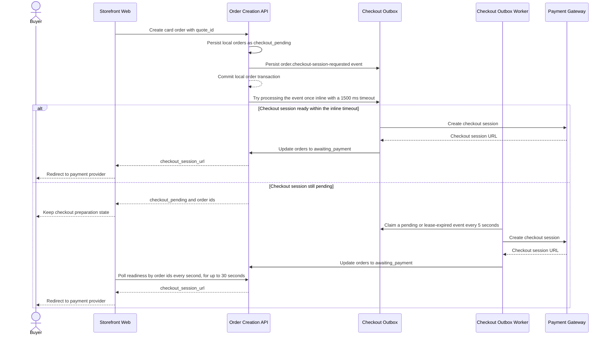

# Async Card Checkout

This flow describes the transactional outbox design for asynchronous card checkout session creation. It was previously documented as a target design and is the current implemented behavior.

Summary:

- card order creation persists local orders as `checkout_pending` before the payment checkout session exists
- after commit, the API tries to process the created checkout outbox event once inline, raced against a 1500 ms timeout, so the normal fast path can still return `checkout_session_url`
- if inline processing does not produce a session, the response remains `checkout_pending` with order ids and the storefront polls `GET /me/checkout/session/readiness?order_ids=` every second for up to 30 seconds
- the worker runs only when the queue driver is Redis, ticks every 5 seconds, and processes batches of 10 pending events
- claiming takes a pessimistic write lock and applies a 30-second lease; processing retries after 15 seconds, 60 seconds, 5 minutes, 15 minutes, and 1 hour, and the event is marked failed after 5 attempts
- a successful claim creates the payment session, records `checkout_session_id`, `checkout_session_url`, and the session expiry, and moves each order from `checkout_pending` to `awaiting_payment` with an `order.status_changed` event
- guests have no readiness route, so guest card checkout depends on the inline fast path
