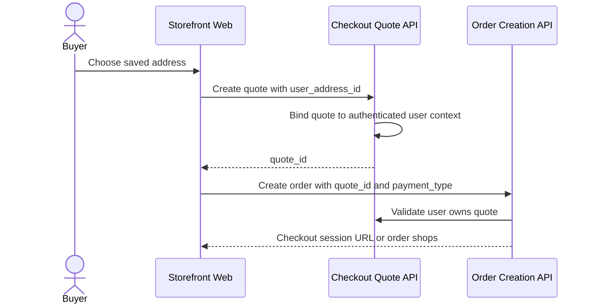

# Authenticated Buyer

This flow describes checkout when buyer identity comes from the active user session.

Summary:

- authenticated checkout uses the current user session for buyer identity
- the frontend sends address identity instead of a full shipping address
- the quote is bound to the authenticated user context
- order creation validates that the current user owns the quote
