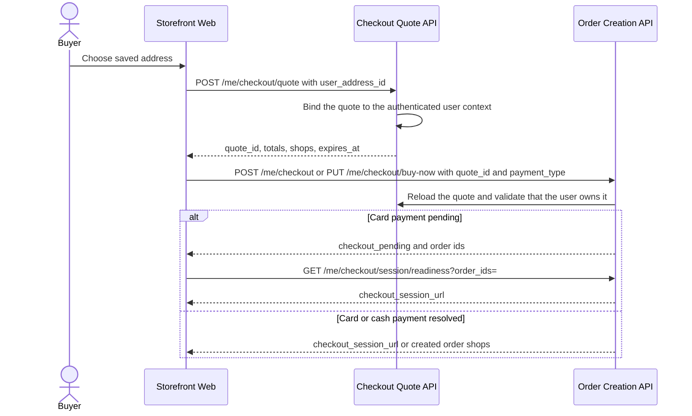

# Authenticated Buyer

This flow describes checkout when buyer identity comes from the active user session.

```mermaid
sequenceDiagram
    actor Buyer
    participant Web as Storefront Web
    participant Quote as Checkout Quote API
    participant Order as Order Creation API

    Buyer->>Web: Choose saved address
    Web->>Quote: POST /me/checkout/quote with user_address_id
    Quote->>Quote: Bind the quote to the authenticated user context
    Quote-->>Web: quote_id, totals, shops, expires_at
    Web->>Order: POST /me/checkout or PUT /me/checkout/buy-now with quote_id and payment_type
    Order->>Quote: Reload the quote and validate that the user owns it
    alt Card payment pending
        Order-->>Web: checkout_pending and order ids
        Web->>Order: GET /me/checkout/session/readiness?order_ids=
        Order-->>Web: checkout_session_url
    else Card or cash payment resolved
        Order-->>Web: checkout_session_url or created order shops
    end
```

Summary:

- authenticated checkout uses the current user session for buyer identity; every `/me/checkout` route requires JWT authentication
- the frontend sends address identity (`user_address_id`) instead of a full shipping address
- the quote is bound to the authenticated user context, and order creation rejects a quote that the caller does not own
- authenticated quote routes are `POST /me/checkout/quote` for cart checkout and `POST /me/checkout/buy-now/quote` for buy-now checkout
- authenticated order routes are `POST /me/checkout` for cart checkout and `PUT /me/checkout/buy-now` for buy-now checkout
- only authenticated buyers can resolve a pending card checkout: the storefront polls `GET /me/checkout/session/readiness?order_ids=` every second for up to 30 seconds
- after cash order creation the buyer goes to the success page and can continue to the authenticated orders route
