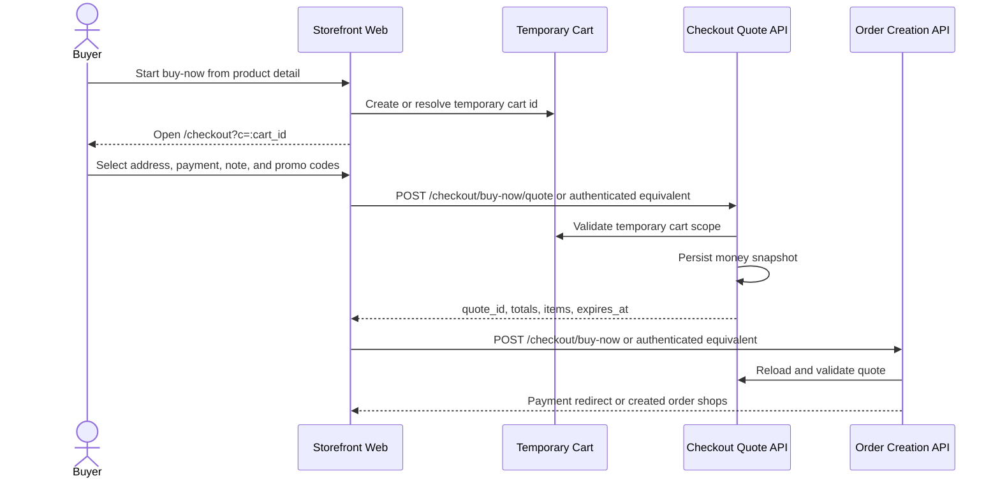

# Buy-Now Checkout

This flow describes checkout from a temporary buy-now cart.

Summary:

- buy-now checkout is scoped by the temporary cart id in the `c` route query
- the current storefront route is `/checkout?c=:cart_id`
- quote creation validates the temporary cart scope and persists the money snapshot
- order creation consumes the buy-now quote before returning a payment redirect or created order shops
