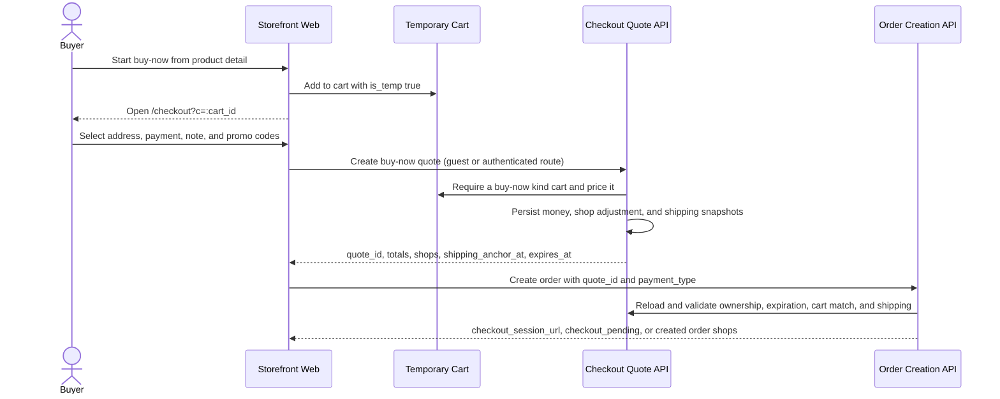

# Buy-Now Checkout

This flow describes checkout from a temporary buy-now cart.

```mermaid
sequenceDiagram
    actor Buyer
    participant Web as Storefront Web
    participant TempCart as Temporary Cart
    participant Quote as Checkout Quote API
    participant Order as Order Creation API

    Buyer->>Web: Start buy-now from product detail
    Web->>TempCart: Add to cart with is_temp true
    Web-->>Buyer: Open /checkout?c=:cart_id
    Buyer->>Web: Select address, payment, note, and promo codes
    Web->>Quote: Create buy-now quote (guest or authenticated route)
    Quote->>TempCart: Require a buy-now kind cart and price it
    Quote->>Quote: Persist money, shop adjustment, and shipping snapshots
    Quote-->>Web: quote_id, totals, shops, shipping_anchor_at, expires_at
    Web->>Order: Create order with quote_id and payment_type
    Order->>Quote: Reload and validate ownership, expiration, cart match, and shipping
    Order-->>Web: checkout_session_url, checkout_pending, or created order shops
```

Summary:

- the storefront route is `/checkout?c=:cart_id`, and the `checkout` route middleware redirects to `/` when the `c` query is missing
- the temporary cart is created by adding to cart with `is_temp: true`, and the returned cart id becomes `c`
- the guest quote route is `POST /checkout/buy-now/quote` and requires the guest cart session cookie; the authenticated route is `POST /me/checkout/buy-now/quote`
- buy-now quote creation sends `cart_id` and requires the cart to be a buy-now cart; it also sends the buyer address (`shipping_address` or `user_address_id`), optional `promo_codes` and `note`, and `presentment_currency` for guests
- quote creation persists the money, shop adjustment, and shipping snapshots, and returns `quote_id`, totals, `shops[]`, `shipping_anchor_at`, and a 30-minute `expires_at`
- order creation uses `POST /checkout/buy-now` for guests and `PUT /me/checkout/buy-now` for authenticated buyers, both with `payment_type` and `quote_id`
- order creation consumes the buy-now quote before returning a payment redirect or created order shops
