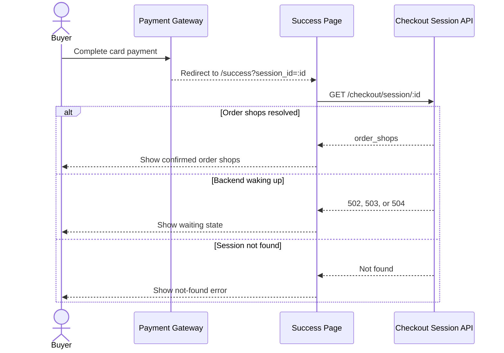

# Card Payment Return

This flow describes how the success page recovers order shops after a payment-provider redirect.

Summary:

- card payment redirects back to `/success?session_id=:id`
- the success page can recover card-created order shops from the checkout session id rather than relying only on browser memory
- transient `502`, `503`, or `504` responses show a waiting state while the backend wakes up
- missing sessions show a not-found error
