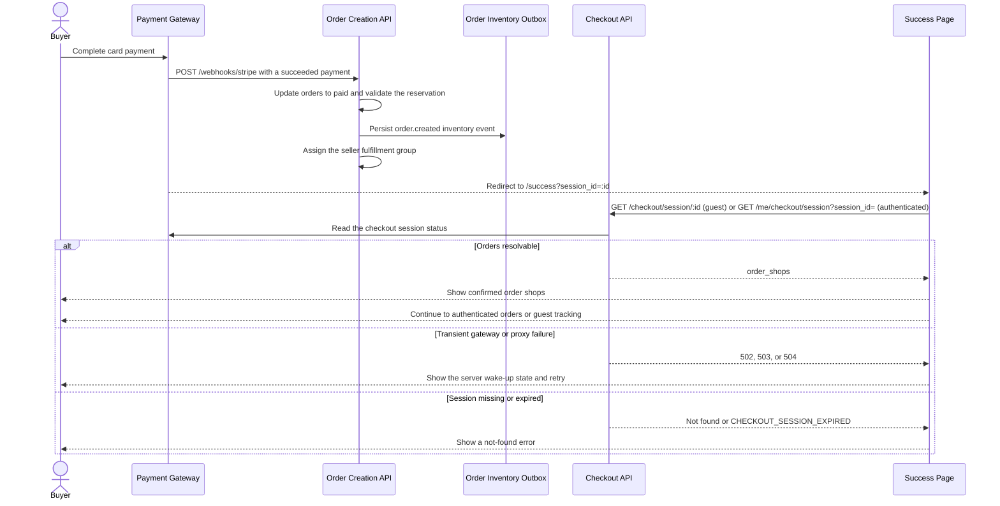

# Card Payment Return

This flow describes card payment completion and how the success page recovers order shops after a payment-provider redirect.

```mermaid
sequenceDiagram
    actor Buyer
    participant Payment as Payment Gateway
    participant Order as Order Creation API
    participant InventoryOutbox as Order Inventory Outbox
    participant API as Checkout API
    participant Web as Success Page

    Buyer->>Payment: Complete card payment
    Payment->>Order: POST /webhooks/stripe with a succeeded payment
    Order->>Order: Update orders to paid and validate the reservation
    Order->>InventoryOutbox: Persist order.created inventory event
    Order->>Order: Assign the seller fulfillment group
    Payment-->>Web: Redirect to /success?session_id=:id
    Web->>API: GET /checkout/session/:id (guest) or GET /me/checkout/session?session_id= (authenticated)
    API->>Payment: Read the checkout session status
    alt Orders resolvable
        API-->>Web: order_shops
        Web-->>Buyer: Show confirmed order shops
        Web-->>Buyer: Continue to authenticated orders or guest tracking
    else Transient gateway or proxy failure
        API-->>Web: 502, 503, or 504
        Web-->>Buyer: Show the server wake-up state and retry
    else Session missing or expired
        API-->>Web: Not found or CHECKOUT_SESSION_EXPIRED
        Web-->>Buyer: Show a not-found error
    end
```

Summary:

- card payment redirects back to `/success?session_id=:id`
- payment success is authoritative on the API side: the Stripe webhook moves `awaiting_payment` orders to `paid`, validates the reservation, writes the `order.created` inventory event, and assigns the seller fulfillment group; the reservation reaches `SOLD` when `inventory-service` consumes that event, and with the default `local` driver the API consumes it at payment success
- the success page resolves order shops through `GET /checkout/session/:session_id` for all buyers; `GET /me/checkout/session?session_id=` exists for authenticated callers but the success page does not use it
- the lookup consults the payment gateway before responding: a paid checkout session is marked completed, and an expired session is marked expired and then returns `CHECKOUT_SESSION_EXPIRED`
- the session lookup response returns `order_shops[].order_number` and shop identity without order ids, unlike the order-creation and readiness responses
- the success page can recover card-created order shops from the checkout session id rather than relying only on browser memory, and it falls back to in-memory checkout state
- the success page shows the wake-up state when the lookup fails with `502`, `503`, or `504`; the API does not emit those statuses itself, so this covers a gateway or proxy in front of it
- the success page returns a not-found error when it has neither a `session_id` query parameter nor in-memory order shops
