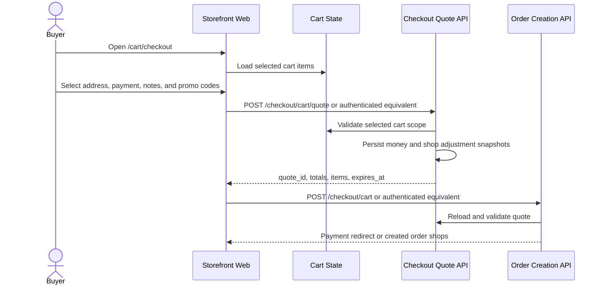

# Cart Checkout

This flow describes checkout from selected cart items.

Summary:

- cart checkout quote input comes from selected cart items plus buyer shipping and shop-level adjustments
- the current storefront route is `/cart/checkout`
- the quote response includes `quote_id`, totals, item snapshots, and expiration
- order creation reloads and validates the quote before returning a payment redirect or created order shops
