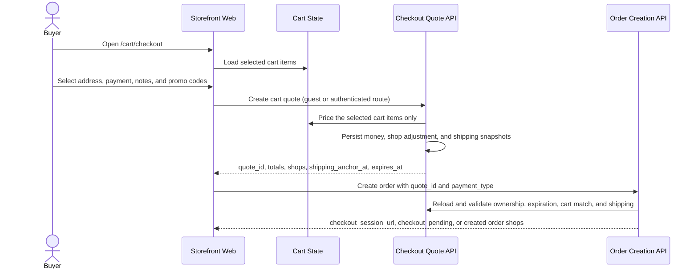

# Cart Checkout

This flow describes checkout from selected cart items.

```mermaid
sequenceDiagram
    actor Buyer
    participant Web as Storefront Web
    participant Cart as Cart State
    participant Quote as Checkout Quote API
    participant Order as Order Creation API

    Buyer->>Web: Open /cart/checkout
    Web->>Cart: Load selected cart items
    Buyer->>Web: Select address, payment, notes, and promo codes
    Web->>Quote: Create cart quote (guest or authenticated route)
    Quote->>Cart: Price the selected cart items only
    Quote->>Quote: Persist money, shop adjustment, and shipping snapshots
    Quote-->>Web: quote_id, totals, shops, shipping_anchor_at, expires_at
    Web->>Order: Create order with quote_id and payment_type
    Order->>Quote: Reload and validate ownership, expiration, cart match, and shipping
    Order-->>Web: checkout_session_url, checkout_pending, or created order shops
```

Summary:

- cart checkout quote input comes from the selected cart items plus buyer shipping destination and shop-level adjustments
- the storefront route is `/cart/checkout`
- the guest quote route is `POST /checkout/cart/quote` and requires the guest cart session cookie; the authenticated route is `POST /me/checkout/quote`
- guest quote creation sends a full `shipping_address` and `presentment_currency`; authenticated quote creation sends `user_address_id`, and either mode may send `addition_info_shop_carts`
- the quote response includes `quote_id`, totals, `shops[]` with the per-shop shipping snapshot, `shipping_anchor_at`, `checkout_policy.max_order_total_minor`, item snapshots, and a 30-minute expiration
- the storefront reuses an accepted quote instead of re-quoting while the cart, address, shop adjustments, and shipping fingerprint still match, and re-quotes when review-step inputs change
- the guest order route is `POST /checkout/cart` with `payment_type`, `quote_id`, and `guest.email`; the authenticated route is `POST /me/checkout` with `payment_type` and `quote_id`
- order creation reloads and validates the quote, then returns a payment redirect or created order shops
