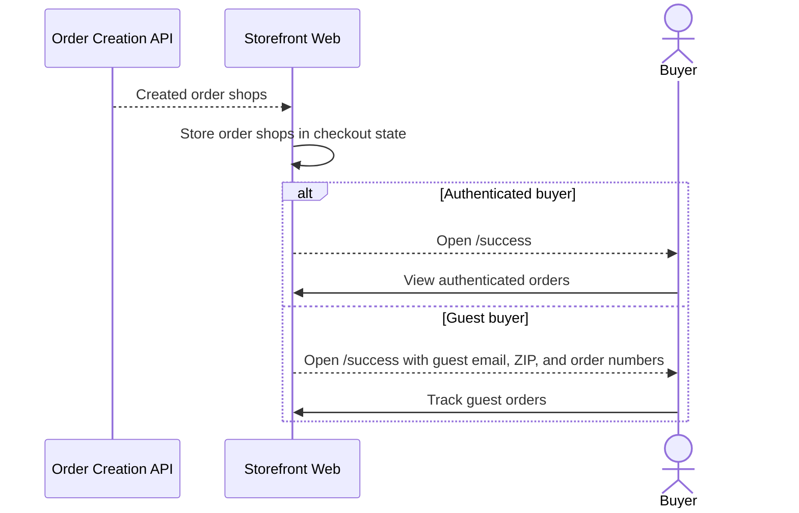

# Cash Payment Success

This flow describes success-page routing after cash order creation.

Summary:

- cash success currently depends on order shops returned during order creation
- the storefront stores returned order shops in checkout state before routing to success
- authenticated buyers can continue to their authenticated orders route
- guest routing carries lookup context in query parameters
