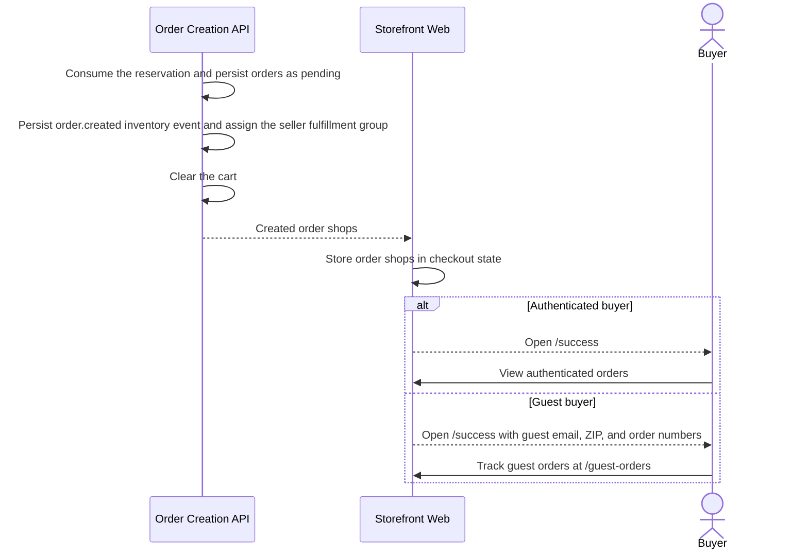

# Cash Payment Success

This flow describes success-page routing after cash order creation.

```mermaid
sequenceDiagram
    participant Order as Order Creation API
    participant Web as Storefront Web
    actor Buyer

    Order->>Order: Consume the reservation and persist orders as pending
    Order->>Order: Persist order.created inventory event and assign the seller fulfillment group
    Order->>Order: Clear the cart
    Order-->>Web: Created order shops
    Web->>Web: Store order shops in checkout state
    alt Authenticated buyer
        Web-->>Buyer: Open /success
        Buyer->>Web: View authenticated orders
    else Guest buyer
        Web-->>Buyer: Open /success with guest email, ZIP, and order numbers
        Buyer->>Web: Track guest orders at /guest-orders
    end
```

Summary:

- cash order creation persists local orders as `pending` and consumes the quoted reservation inside the same transaction
- the reservation is consumed before the success page is involved, so cash success currently depends on order shops returned during order creation
- for quote-backed cash orders the API also writes the `order.created` inventory event, assigns the seller fulfillment group, and clears the cart
- the storefront stores returned order shops in checkout state before routing to success
- authenticated buyers can continue to their authenticated orders route
- guest routing carries lookup context (guest email, ZIP, and order numbers) so the buyer can track orders at `/guest-orders`
- the success page returns a not-found error when it has neither a `session_id` query parameter nor in-memory order shops, and it clears the stored order shops when it unmounts
