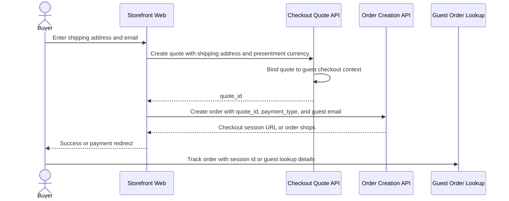

# Guest Buyer

This flow describes checkout when buyer identity comes from guest shipping and contact inputs.

Summary:

- guest checkout sends a full shipping address during quote creation
- guest checkout sends buyer email during order creation
- the quote is bound to guest checkout context
- guest checkout must preserve enough tracking context after order creation for the buyer to find the created order shops
