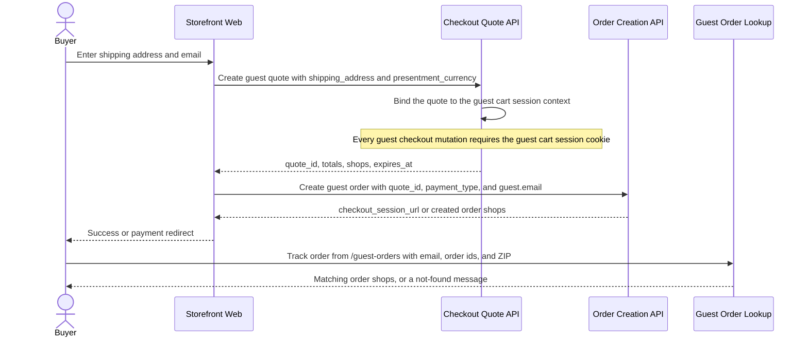

# Guest Buyer

This flow describes checkout when buyer identity comes from guest shipping and contact inputs.

```mermaid
sequenceDiagram
    actor Buyer
    participant Web as Storefront Web
    participant Quote as Checkout Quote API
    participant Order as Order Creation API
    participant GuestLookup as Guest Order Lookup

    Buyer->>Web: Enter shipping address and email
    Web->>Quote: Create guest quote with shipping_address and presentment_currency
    Quote->>Quote: Bind the quote to the guest cart session context
    Note over Quote: Every guest checkout mutation requires the guest cart session cookie
    Quote-->>Web: quote_id, totals, shops, expires_at
    Web->>Order: Create guest order with quote_id, payment_type, and guest.email
    Order-->>Web: checkout_session_url or created order shops
    Web-->>Buyer: Success or payment redirect
    Buyer->>GuestLookup: Track order from /guest-orders with email, order ids, and ZIP
    GuestLookup-->>Buyer: Matching order shops, or a not-found message
```

Summary:

- guest checkout sends a full shipping address during quote creation and the buyer email during order creation
- every guest checkout mutation requires the guest cart session cookie and otherwise fails with a raw `Guest cart session not found` 404
- the quote is bound to guest checkout context, and order creation rejects a quote that the caller does not own
- guest routes are `POST /checkout/cart/quote`, `POST /checkout/buy-now/quote`, `POST /checkout/cart`, and `POST /checkout/buy-now`
- guest card checkout has no readiness polling: it depends on the inline fast path returning `checkout_session_url`, and otherwise surfaces a generic failure
- guest tracking lives at `/guest-orders` and looks up through `GET /checkout/guest-orders`, using either a tracking token, a checkout `session_id`, or `email` with order ids and `zip`
- guest order lookup is throttled to 5 requests per 60 seconds, and guest checkout must preserve enough tracking context after order creation for the buyer to find the created order shops
