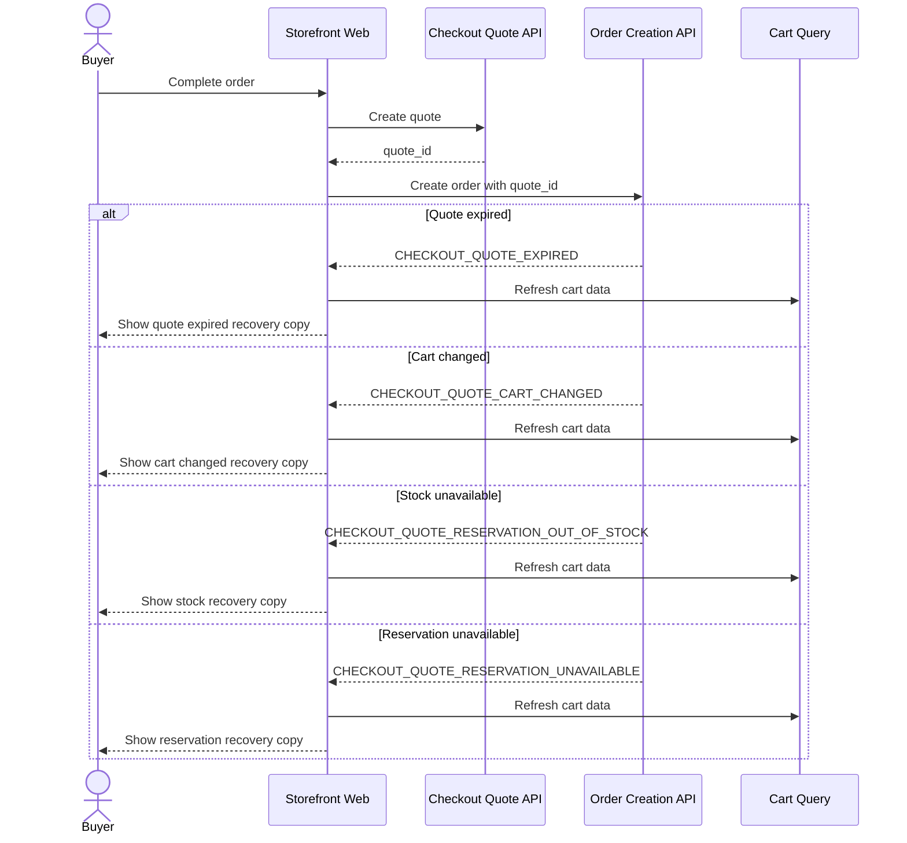

# Recoverable Failure Flow

This flow describes checkout invalidation failures that can be recovered by refreshing cart data.

Summary:

- recoverable checkout failures refresh cart data because the buyer needs the latest selected items, totals, and availability before retrying
- expired quotes show quote-expired recovery copy
- changed carts show cart-changed recovery copy
- stock and reservation failures show inventory-specific recovery copy
