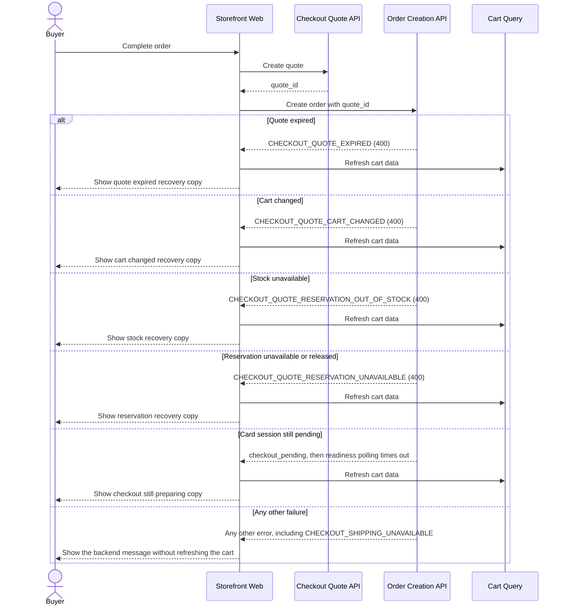

# Recoverable Failure Flow

This flow describes checkout failures that the buyer can recover from, and which of them refresh cart data.

```mermaid
sequenceDiagram
    actor Buyer
    participant Web as Storefront Web
    participant Quote as Checkout Quote API
    participant Order as Order Creation API
    participant Cart as Cart Query

    Buyer->>Web: Complete order
    Web->>Quote: Create quote
    Quote-->>Web: quote_id
    Web->>Order: Create order with quote_id
    alt Quote expired
        Order-->>Web: CHECKOUT_QUOTE_EXPIRED (400)
        Web->>Cart: Refresh cart data
        Web-->>Buyer: Show quote expired recovery copy
    else Cart changed
        Order-->>Web: CHECKOUT_QUOTE_CART_CHANGED (400)
        Web->>Cart: Refresh cart data
        Web-->>Buyer: Show cart changed recovery copy
    else Stock unavailable
        Order-->>Web: CHECKOUT_QUOTE_RESERVATION_OUT_OF_STOCK (400)
        Web->>Cart: Refresh cart data
        Web-->>Buyer: Show stock recovery copy
    else Reservation unavailable or released
        Order-->>Web: CHECKOUT_QUOTE_RESERVATION_UNAVAILABLE (400)
        Web->>Cart: Refresh cart data
        Web-->>Buyer: Show reservation recovery copy
    else Card session still pending
        Order-->>Web: checkout_pending, then readiness polling times out
        Web->>Cart: Refresh cart data
        Web-->>Buyer: Show checkout still preparing copy
    else Any other failure
        Order-->>Web: Any other error, including CHECKOUT_SHIPPING_UNAVAILABLE
        Web-->>Buyer: Show the backend message without refreshing the cart
    end
```

Summary:

- recoverable checkout failures refresh cart data because the buyer needs the latest selected items, totals, and availability before retrying
- the storefront resolves five failure kinds: four from backend codes (`CHECKOUT_QUOTE_EXPIRED`, `CHECKOUT_QUOTE_CART_CHANGED`, `CHECKOUT_QUOTE_RESERVATION_OUT_OF_STOCK`, `CHECKOUT_QUOTE_RESERVATION_UNAVAILABLE`) plus one from the client-side `Checkout session is still being prepared` polling message
- expired quotes show quote-expired recovery copy, changed carts show cart-changed recovery copy, and stock and reservation failures show inventory-specific recovery copy
- `CHECKOUT_QUOTE_EXPIRED` also expires the quote and releases its reservation before the error is returned
- card checkout that stays pending past the 30-second readiness deadline shows the checkout-still-preparing copy
- cart data is refreshed for every mapped failure kind, but not for an unmapped failure: those show the backend message as the toast title
- `CHECKOUT_SHIPPING_UNAVAILABLE` (409, with `products[].reason`) is returned by quote creation and order creation when a quoted product cannot be delivered, but the storefront does not map it yet, so it currently surfaces through the unmapped failure path
