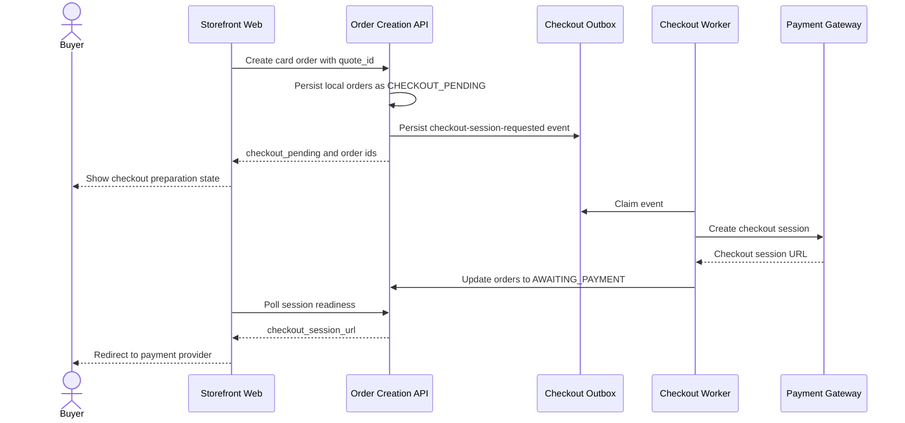

# Target Async Card Checkout

This flow describes the target transactional outbox design for asynchronous card checkout session creation.

Summary:

- this is the target flow described by the checkout transactional outbox design
- card order creation can persist local orders as `CHECKOUT_PENDING` before the payment checkout session exists
- the worker claims the outbox event, creates the payment-provider session, and updates orders to `AWAITING_PAYMENT`
- the current storefront still expects `checkout_session_url` immediately, so adopting this flow requires an explicit frontend/API contract update
