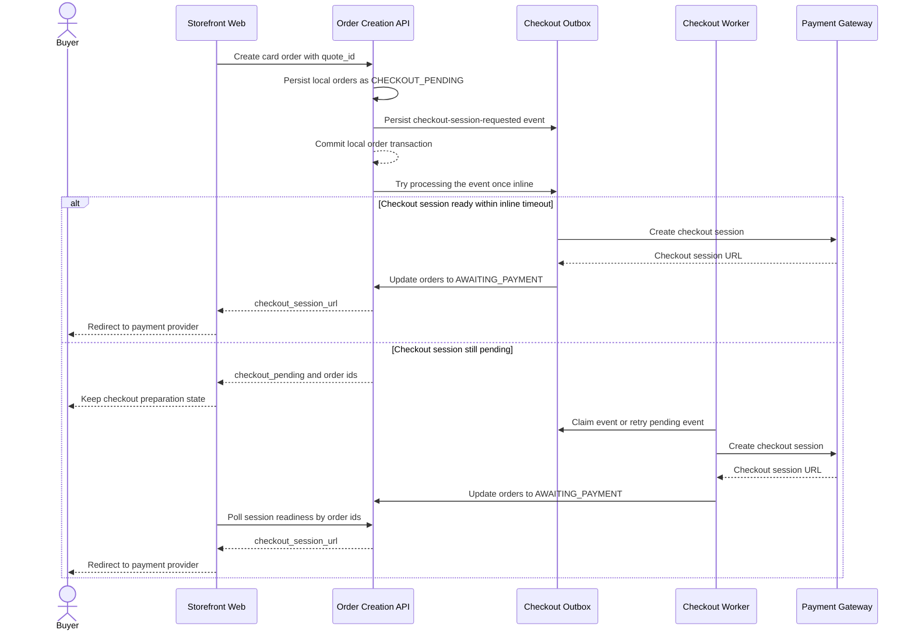

# Target Async Card Checkout

This flow describes the target transactional outbox design for asynchronous card checkout session creation.

Summary:

- card order creation persists local orders as `CHECKOUT_PENDING` before the payment checkout session exists
- after commit, the API tries to process the created checkout outbox event once inline so the normal fast path can still return `checkout_session_url`
- if inline processing times out or the event is not ready, the response remains `checkout_pending` with order ids and the storefront polls readiness by order ids
- the worker claims or retries pending checkout events, creates the payment-provider session, and updates orders to `AWAITING_PAYMENT`
