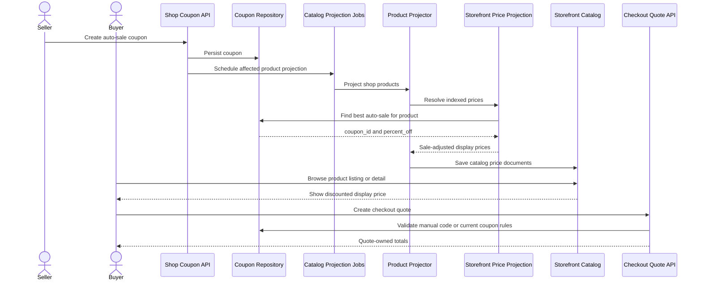

# Coupon Flow

This document is the entry point for end-to-end coupon lifecycle examples across auto-sale display pricing, manual redemption, product targeting, and catalog reprojection.

For scope, vocabulary, boundaries, and implementation notes, see [README.md](README.md).

## Main Flow

Summary:

- auto-sale coupons affect catalog/storefront display prices through projection
- manual coupons affect checkout quotes through redemption validation
- catalog display pricing is not the source of checkout truth
- the best auto-sale for a product is the highest active percentage coupon matching the product scope

## Detailed Flows

- [Auto-Sale Display Pricing](flows/auto-sale-display-pricing.md)
- [Manual Coupon Redemption](flows/manual-coupon-redemption.md)
- [Coupon Create Projection](flows/coupon-create-projection.md)
- [Coupon Delete Projection](flows/coupon-delete-projection.md)
- [Coupon Expiry Projection](flows/coupon-expiry-projection.md)
- [Coupon Product Scope](flows/coupon-scope-products.md)
