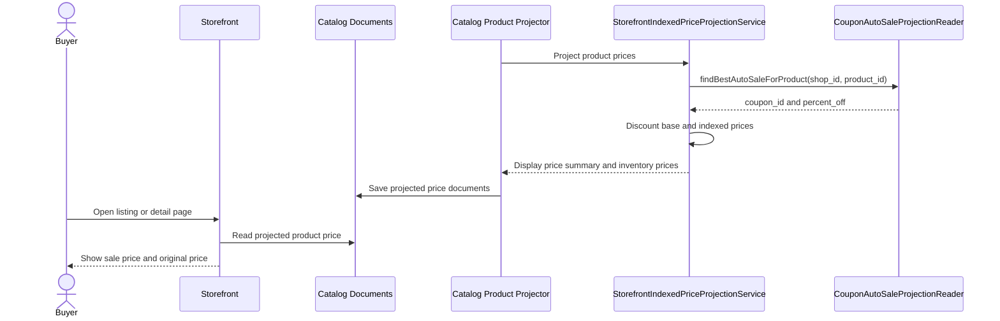

# Auto-Sale Display Pricing

This flow describes how an active auto-sale coupon becomes storefront display pricing.

Summary:

- auto-sale display pricing is computed during catalog projection
- `findBestAutoSaleForProduct` returns the highest active percentage auto-sale matching the product
- the projected price carries `autoSale` metadata with `couponId` and `percentOff`
- checkout does not trust the displayed catalog price as final order authority
