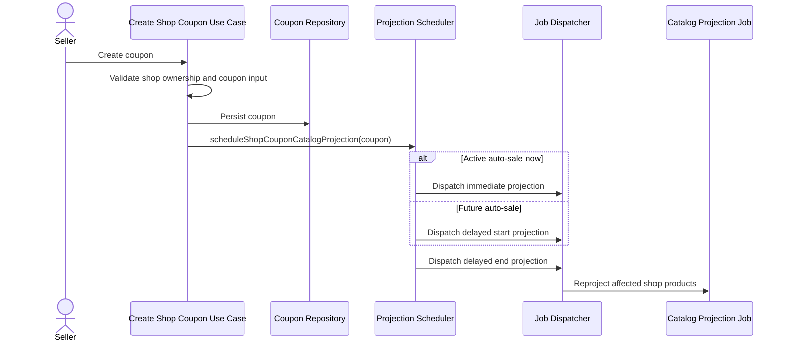

# Coupon Create Projection

This flow describes seller coupon creation and catalog projection scheduling.

Summary:

- all coupons are persisted before projection scheduling
- only active or scheduled auto-sale percentage coupons need catalog display-price projection
- `appliesTo=ALL` schedules shop-wide projection
- `appliesTo=SPECIFIC` schedules projection for the listed product ids
