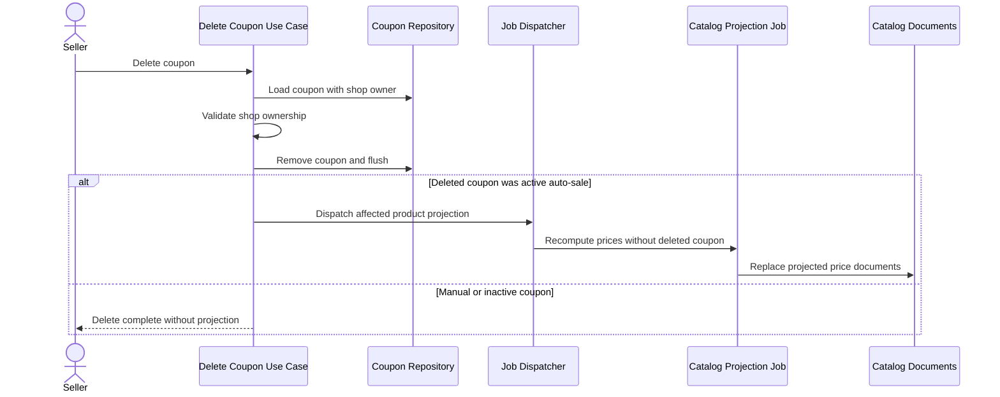

# Coupon Delete Projection

This flow describes catalog cleanup after a seller deletes one or more coupons.

Summary:

- deletion flushes before projection dispatch
- active auto-sale deletion must reproject affected products so stale sale prices disappear
- manual coupon deletion does not require catalog projection
- bulk deletion can combine product ids and dispatch one projection job
