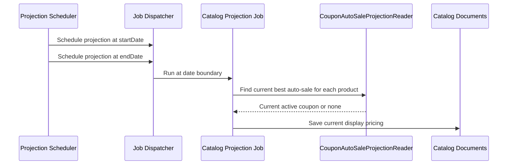

# Coupon Expiry Projection

This flow describes start and end date projection for auto-sale coupons.

Summary:

- future auto-sales need a start-date projection so discounts appear when active
- active auto-sales need an end-date projection so discounts disappear when expired
- projection recomputes from current coupon state instead of trusting the originally scheduled coupon
- overlapping coupons are resolved by the current best matching auto-sale at projection time
