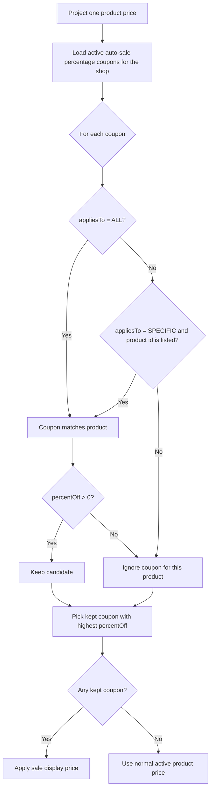

# Coupon Product Scope

This flow describes how coupon product targeting affects projection.

Summary:

- `appliesTo=ALL` affects every product in the shop
- `appliesTo=SPECIFIC` affects only listed product ids
- non-matching product-scoped coupons are ignored even if they have a higher percentage
- when no coupon matches, projected display pricing uses the product's normal active price
