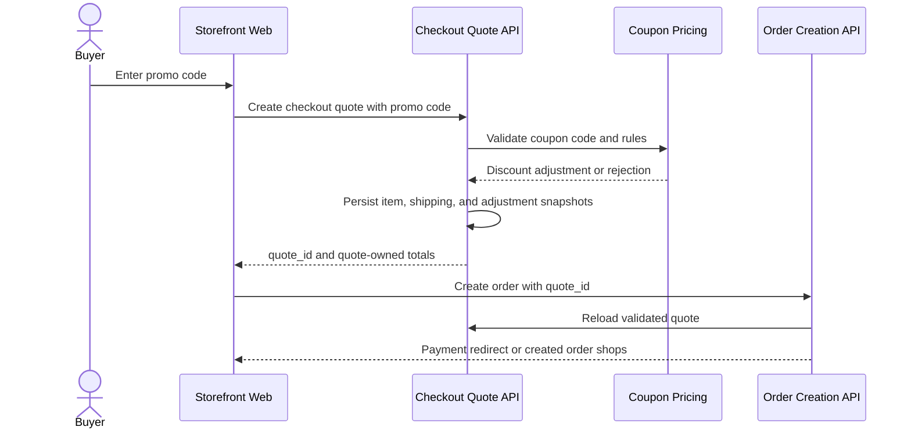

# Manual Coupon Redemption

This flow describes a buyer entering a coupon code during checkout.

Summary:

- manual coupon redemption happens at checkout quote creation
- checkout quote owns the final totals and adjustment snapshots
- manual redemption can apply usage limits, minimum order/product rules, and buyer context
- manual redemption does not depend on catalog auto-sale projections
