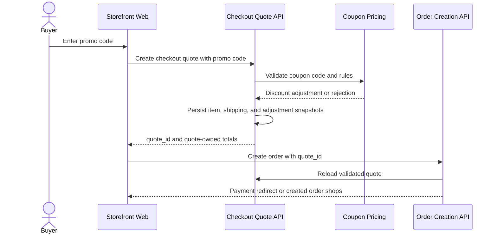

# Manual Coupon Redemption

This flow describes a buyer entering a coupon code or selecting an eligible public shop coupon during checkout.

```mermaid
sequenceDiagram
    actor Buyer
    participant Web as Storefront Web
    participant Quote as Checkout Quote API
    participant Coupon as Coupon Pricing
    participant Order as Order Creation API

    Buyer->>Web: Enter promo code
    Web->>Quote: Create checkout quote with promo code
    Quote->>Coupon: Validate coupon code and rules
    Coupon-->>Quote: Discount adjustment or rejection
    Quote->>Quote: Persist item, shipping, and adjustment snapshots
    Quote-->>Web: quote_id and quote-owned totals
    Web->>Order: Create order with quote_id
    Order->>Quote: Reload validated quote
    Order-->>Web: Payment redirect or created order shops
```

Summary:

- manual coupon redemption happens at checkout quote creation
- checkout quote owns the final totals and adjustment snapshots
- manual redemption can apply usage limits, minimum order/product rules, and buyer context
- manual redemption does not depend on catalog auto-sale projections

## Coupon Picker

- Both cart checkout and buy-now checkout open a shop-named popover from **Apply shop coupon codes**.
- The input section accepts known codes, including `code_only` coupons. The list section shows the shop's public manual coupons, including ones the current cart cannot use yet: each item carries `is_eligible` plus an `ineligible_reason` (not_started, expired, inactive, usage_limit_reached, user_usage_limit_reached, product_scope, min_order_value, min_products), ordered eligible first. `code_only` and automatic-sale coupons are absent from the list.
- The storefront renders an ineligible coupon as a disabled, non-activatable card with its reason, so a buyer can see what a coupon requires instead of it silently disappearing. Only the server decides eligibility; the browser never hides or enables a coupon the API flagged.
- `GET /v1/cart/coupons?shop_id=…&cart_id=…` resolves the current actor's cart and returns the shop's public manual coupons for the selected shop items, flagged with `is_eligible` and, when ineligible, an `ineligible_reason`. `cart_id` is optional for the regular cart and supplied for buy-now carts.
- `POST /v1/cart/coupons/apply` accepts `shop_id`, optional `cart_id`, `code`, and the shop's current `promo_codes`. It returns the validated replacement `promo_codes` without persisting selection.
- Each shop has two manual coupon slots: one free-shipping coupon and one fixed-amount or percentage coupon. The API rejects conflicting selections during pricing; the apply endpoint replaces the old coupon in the requested code's slot and validates the resulting selection.
- The storefront commits the selection only after pricing succeeds, refreshes checkout totals, and closes the popover. Failed application leaves the popover open and the previous selection intact.
- Applied codes and remove controls remain visible outside the popover. Closing the popover does not remove coupons.
- Coupon monetary display fields are major-unit amounts already resolved into the response's `currency` (the buyer's checkout currency). A Coupon stores `amount_off` and `min_order_value` in its own canonical `currency`, snapshotted from the owning Shop at creation, so listing, redemption, and discount amounts all resolve through the shared currency-conversion seam. When no rate is available the Coupon is omitted from the list and rejected on apply, never applied at its native face value.
- Coupon currency resolution does not alter auto-sale pricing.
