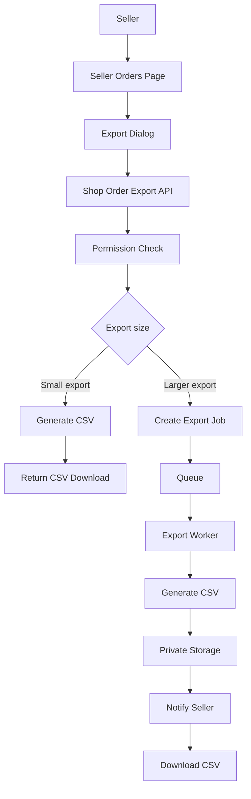
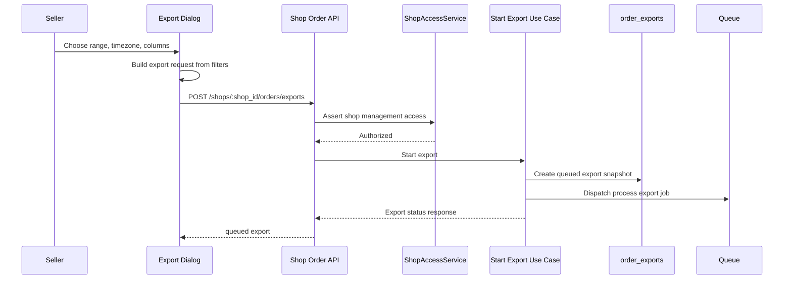
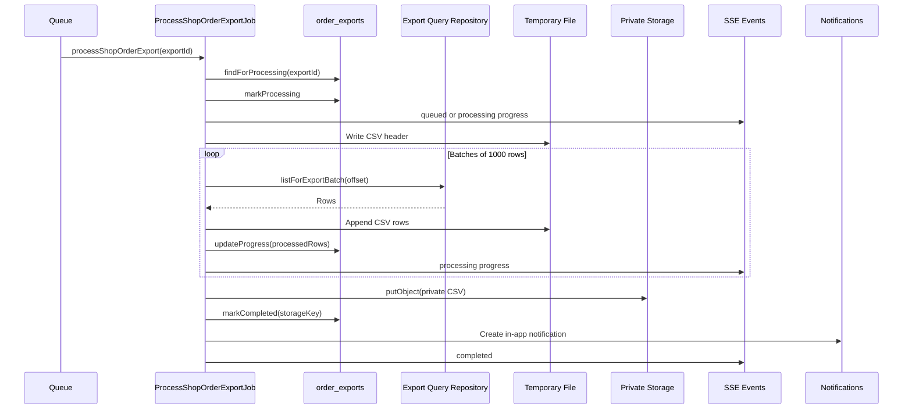
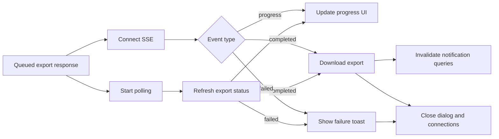

# Export Order Design

## Purpose

This document describes the runtime wiring for seller order CSV export. It shows how the seller orders page, export dialog, REST API, export use cases, queue worker, private storage, SSE progress, and notification download fit together.

Order export is seller-owned operational reporting. It is not buyer-facing order history, accounting reconciliation, audit-log export, or marketplace-wide analytics.

## Components

- **Seller export UI** collects filters, date range, timezone, column preset, and optional custom columns.
- **Shop order export API** authorizes the seller and starts synchronous or asynchronous exports.
- **Export job state** stores lifecycle status, filter snapshots, selected columns, row counts, storage keys, and failures.
- **Order data reads** provide seller-visible order rows using the same filter boundary as the seller order list.
- **Export worker** generates CSV files for asynchronous exports.
- **Private storage** stores completed asynchronous CSV files under private shop export keys.
- **SSE updates** send queued, processing, completed, and failed progress to the requesting seller.
- **In-app notifications** give the seller a durable download affordance after the export completes.

## High-Level Flow

## Start Export

1. The seller opens the export dialog from the seller orders page.
2. The dialog starts with a date range preset, the default timezone, default columns, and the current order list filters.
3. For preset and custom date ranges, the seller app converts the selected calendar dates into concrete `created_from` and `created_to` timestamps using the selected timezone.
4. The request includes existing order filters, export metadata, and either the server default column preset or selected custom column IDs.
5. The seller app resolves the active shop and calls `POST /shops/:shop_id/orders/exports`.
6. The API checks `shops.manage` and confirms the actor can manage the requested shop before creating the export.

## Synchronous CSV Export

The API also exposes `GET /shops/:shop_id/orders/export` for direct CSV generation. This path is for small exports that can finish inside one HTTP request.

1. The controller authorizes the seller against the shop.
2. `ExportShopOrdersUseCase` resolves the requested columns.
3. The export query repository reads matching order rows with the synchronous export limit.
4. CSV output is built in memory.
5. The controller returns `text/csv` with a generated `orders-<timestamp>.csv` attachment filename.

The current synchronous limit is `10,000` rows. Larger or long-running reports should use the asynchronous export resource so the seller can continue using the app while the CSV is generated.

## Asynchronous Export

Asynchronous export is the primary flow from the seller dialog.

1. `StartShopOrderExportUseCase` resolves the final column list from the requested preset and allowlisted column IDs.
2. It counts matching rows before enqueueing so progress can show processed rows against a total.
3. It stores a snapshot of the filters and column IDs in `order_exports`.
4. The export record starts as queued, receives a generated filename, and expires after seven days.
5. The queue dispatch uses an export-specific deduplication key for the created export ID.
6. `ProcessShopOrderExportJob` reloads the export for processing and ignores missing or already completed exports.
7. The job restores the query from the stored filter snapshot and selected column IDs.
8. It marks the export as processing and publishes an initial progress event.
9. It writes the CSV header to a temporary file.
10. It reads rows in batches, appends CSV rows, updates processed row count, and publishes progress.
11. It uploads the completed CSV to private storage.
12. It marks the export completed, creates an in-app notification, and emits the completed SSE event.

## Progress And Completion

The seller app uses SSE and polling together:

1. After `POST /exports` returns, the dialog opens an `EventSource` connection to `/me/events`.
2. The dialog also starts a one-second status poll with `GET /shops/:shop_id/orders/exports/:export_id`.
3. Progress events update the progress percentage and row-count label.
4. Completed events or completed poll responses call the download endpoint.
5. The browser downloads the CSV blob and the dialog closes.
6. Notification query caches are invalidated so the header notification popover reflects the completed export.
7. The event connection and poll timer are closed when the export finishes or the dialog unmounts.

## Download Flow

Completed asynchronous exports are downloaded with `GET /shops/:shop_id/orders/exports/:export_id/download`.

1. The controller rechecks shop management access.
2. `DownloadShopOrderExportUseCase` loads the export and validates that it belongs to the shop and has completed.
3. The storage object is read from the private storage key recorded on the export.
4. The controller returns `text/csv` with the export filename as an attachment.
5. The seller app converts the response blob into a temporary object URL and clicks a hidden download link.

The completed in-app notification stores enough routing data for the notification popover to download the same export later: shop ID, export ID, filename, and an `order_export_download` target.

## Column Selection And CSV Safety

Export columns are server-controlled. The frontend can offer default and custom choices, but the backend decides which column IDs are valid and how each cell is read from an export row.

Default exports use the server-defined default column IDs. Custom exports use the intersection of requested IDs and the server allowlist. If a custom request resolves to no valid columns, the backend falls back to the default export columns.

CSV generation applies these rules:

1. Headers come from server column labels.
2. `null` and `undefined` cells become empty strings.
3. `Date` cells are written as ISO timestamps.
4. Cells are always quoted.
5. Embedded quotes are doubled.
6. Values beginning with spreadsheet formula markers are prefixed with a single quote before quoting.

Formula marker handling reduces CSV injection risk for values beginning with `=`, `+`, `-`, `@`, tab, or carriage return.

## Failure Handling

If export start fails, the seller app shows a failure toast and leaves the dialog available for retry.

If the background job fails:

1. The job marks the export failed with an error message.
2. It emits an order export failed SSE event for the requesting user.
3. The seller app updates active export state, shows a failure toast, and closes the event connection.
4. Polling also observes failed status and shows the same failure path when SSE is unavailable.

Temporary files are removed in the job cleanup path whether the export succeeds or fails.

## Boundaries

- Export authorization uses the same shop management boundary as seller order list and detail behavior.
- Export requests are scoped to one shop and must not expose orders from another shop.
- Export filters are snapshots. A queued export should represent the filters chosen when the seller started it, not later UI changes.
- Asynchronous export files are private storage objects and should be downloaded through the authorized API, not public URLs.
- Export lifecycle state is durable, but the active dialog progress UI is browser-session state.
- Completed exports currently expire after seven days.
- Adding a new exportable field requires updating the server column allowlist and, when user-selectable, the seller dialog column list.

## Related Documents

- [Shop Order CSV Export ADR](../apps/api/api/docs/adrs/003-shop-order-csv-export.md)
- [Shop Order Export Glossary](../apps/api/api/docs/shop-order-export-glossary.md)
