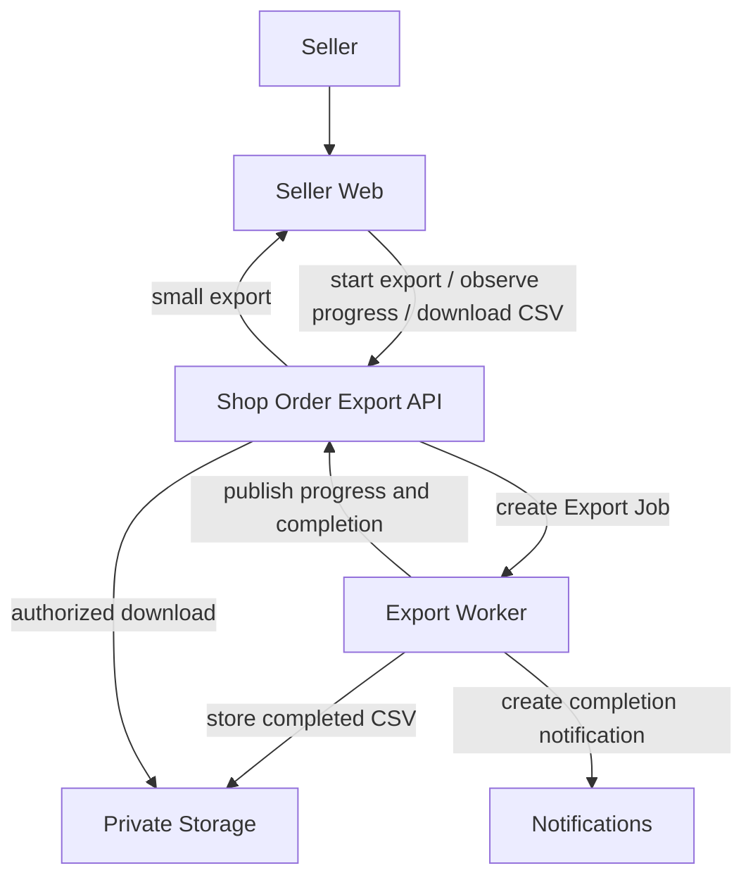

# Export Order Design

## Overview

Order Export lets a seller export seller-visible order rows as a CSV report from the seller orders page.

The feature supports small direct downloads and larger asynchronous exports with progress, private storage, and a durable download affordance after completion.

Order Export is seller-owned operational reporting. It is not buyer-facing order history, accounting reconciliation, audit-log export, or marketplace-wide analytics.

## Goals

- Let sellers export order data using the same filter boundary as the seller orders list.
- Keep export authorization scoped to one manageable shop.
- Support direct CSV download for small exports.
- Process larger exports asynchronously so sellers can continue using the app.
- Show queued, processing, completed, and failed progress.
- Store completed asynchronous CSV files as private artifacts.
- Give sellers a download path after an asynchronous export completes.
- Generate CSV safely for spreadsheet consumers.

## Scope

In scope:

- Seller orders page export entry point.
- Export dialog with filters, date range, timezone, column preset, and optional custom columns.
- Synchronous CSV export for small reports.
- Asynchronous export job creation and processing for larger reports.
- Export progress UI using events with polling fallback.
- Completed CSV download.
- In-app completion notification for asynchronous exports.
- Server-controlled export columns and CSV safety rules.

Out of scope:

- Buyer-facing order export.
- Marketplace-wide order analytics.
- Accounting or payout reconciliation reports.
- Audit-log export.
- Public CSV URLs.
- Long-term export archive management beyond the current retention window.

## System Context

## Export Modes

### Synchronous Export

Synchronous export is for small reports that can finish inside one HTTP request.

Behavior:

- the seller starts an export from the seller orders surface
- the request is authorized against the active shop
- matching order rows are read using the seller-visible filter boundary
- CSV is generated and returned as a download response

The current synchronous limit is `10,000` rows. Larger or long-running reports should use asynchronous export.

### Asynchronous Export

Asynchronous export is the primary flow from the seller export dialog.

Behavior:

- the seller starts an export with filters, timezone, date range, and columns
- the system stores a snapshot of the export request
- the export is processed in the background
- progress is reported while rows are processed
- the completed CSV is stored privately
- the seller can download the CSV through an authorized endpoint

Completed asynchronous exports currently expire after seven days.

## Export Request Contract

The export request captures:

- active shop
- current order list filters
- date range converted to concrete timestamps using the selected timezone
- timezone
- column preset or selected custom column IDs
- export metadata needed for progress, filename, and download

Export filters are snapshots. A queued export represents the filters chosen when the seller started it, not later changes to the orders page.

## State Model

Export statuses:

- `queued`
- `processing`
- `completed`
- `failed`

Progress fields:

- total rows
- processed rows
- selected columns
- generated filename
- failure message when applicable
- storage reference when completed
- expiration timestamp

## Column Selection And CSV Safety

Export columns are server-controlled. The frontend can offer default and custom choices, but the backend decides which column IDs are valid and how each cell is read from an export row.

Default exports use the server-defined default column IDs. Custom exports use the intersection of requested IDs and the server allowlist. If a custom request resolves to no valid columns, the backend falls back to the default export columns.

CSV generation applies these rules:

1. Headers come from server column labels.
2. Empty cells are written as empty strings.
3. Date cells are written as ISO timestamps.
4. Cells are always quoted.
5. Embedded quotes are doubled.
6. Values beginning with spreadsheet formula markers are prefixed before quoting.

Formula marker handling reduces CSV injection risk for values beginning with `=`, `+`, `-`, `@`, tab, or carriage return.

## Key Invariants

- Export authorization uses the same shop management boundary as seller order list and detail behavior.
- Export requests are scoped to one shop and must not expose orders from another shop.
- Export filters are snapshots taken at export start.
- Asynchronous export files are private storage objects.
- Completed export files are downloaded through authorized API endpoints, not public URLs.
- Active dialog progress is browser-session state; export lifecycle state is durable.
- Adding a new exportable field requires updating the server column allowlist and, when user-selectable, the seller dialog column list.
- Temporary files are cleaned up whether background export processing succeeds or fails.

## Failure Handling

If export start fails, the seller app shows a failure state and leaves the dialog available for retry.

If background processing fails:

- the export becomes `failed`
- progress delivery reports the failed state
- polling can observe the same failed state when events are unavailable
- the seller sees a retry or dismissal path instead of a download

## Constraints

- Small direct exports are limited to `10,000` rows.
- Completed asynchronous exports currently expire after seven days.
- CSV files are private artifacts.
- Progress delivery should tolerate stale or unavailable event streams by using status polling.

## Related Documents

- [Flow](flow.md)
- [Shop Order CSV Export ADR](../../../apps/api/api/docs/adrs/003-shop-order-csv-export.md)
- [Shop Order Export Glossary](../../../apps/api/api/docs/shop-order-export-glossary.md)
