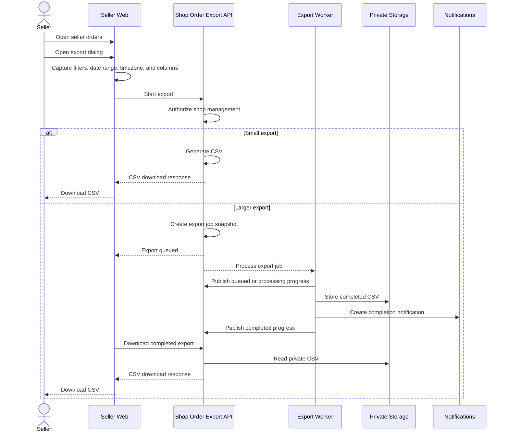
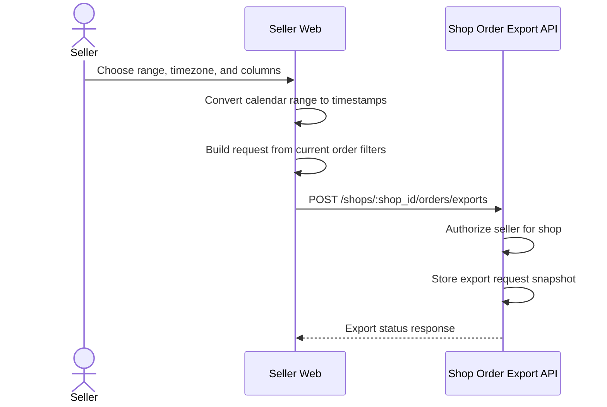
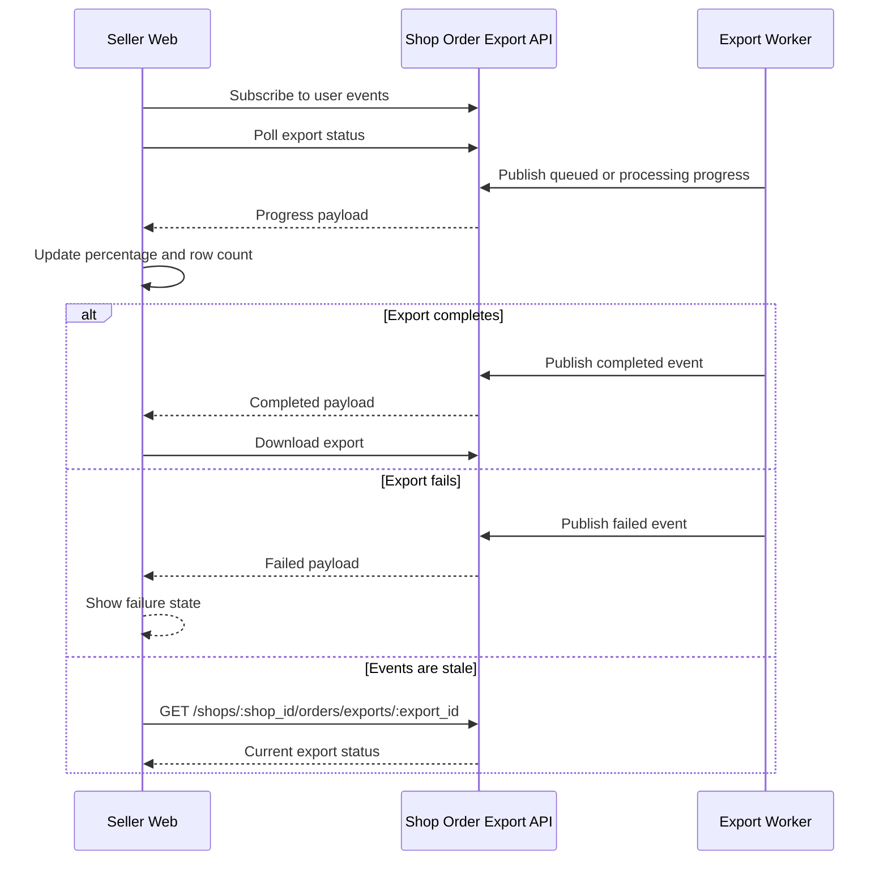
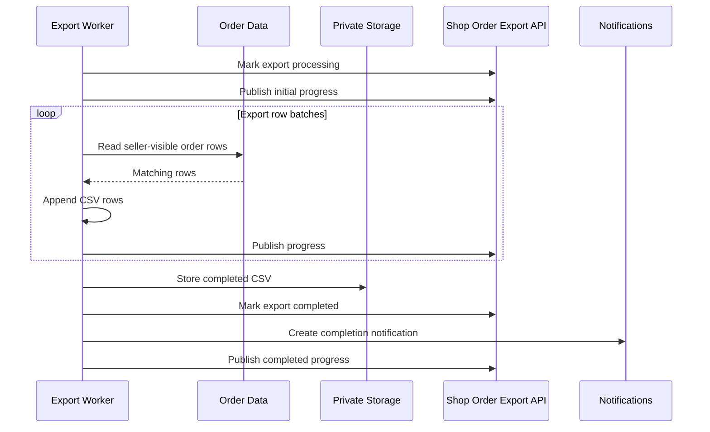
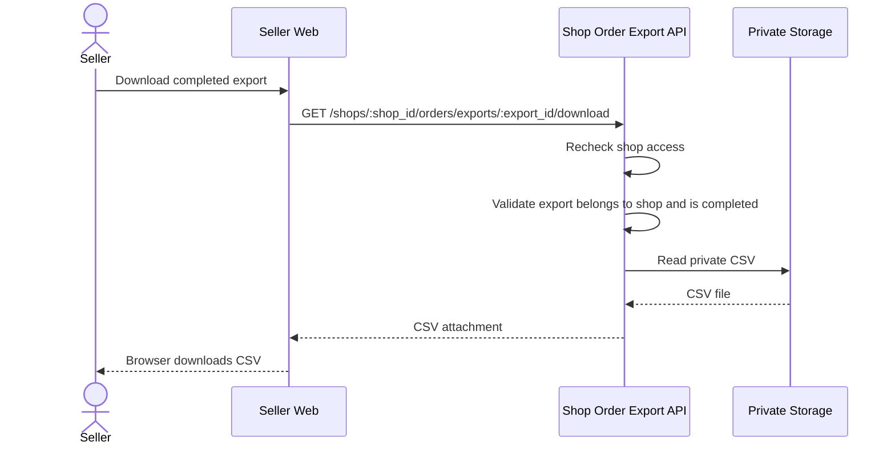
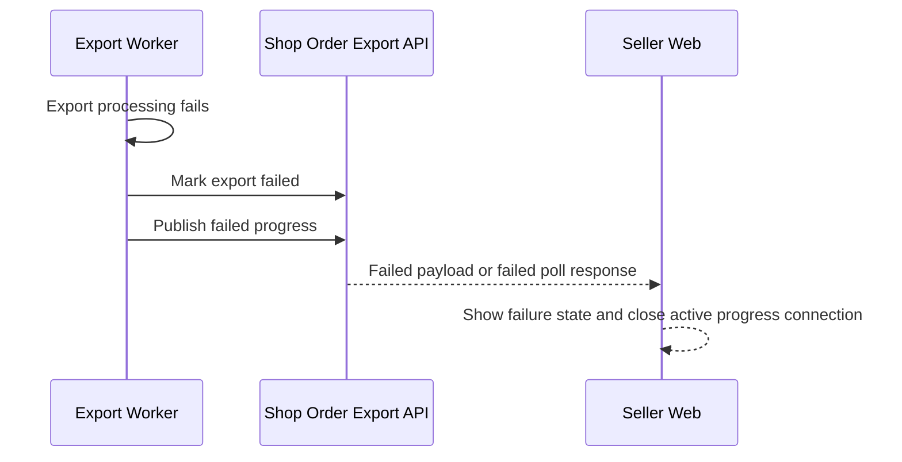

# Export Order Flow

## Main Flow

## Start Export

The request includes existing order filters, export metadata, and either the default column preset or selected custom column IDs.

## Progress Flow

The seller app uses events and polling together so progress can continue when one delivery path is unavailable.

## Asynchronous Processing

Asynchronous processing restores the stored filter and column snapshot instead of reading the seller's current browser state.

## Download Flow

The completed in-app notification stores enough routing data for the seller to download the same export later.

## Failure Flow

Temporary files are removed whether export processing succeeds or fails.
