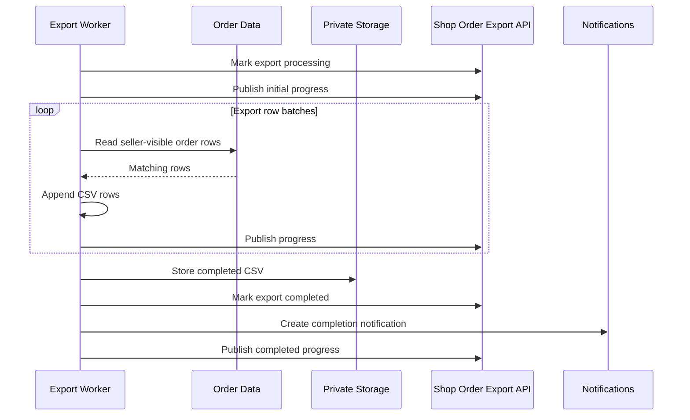

# Asynchronous Processing

See the [design](../README.md) and [flow index](../flow.md).

Asynchronous processing restores the stored filter and column snapshot instead of reading the seller's current browser state.
