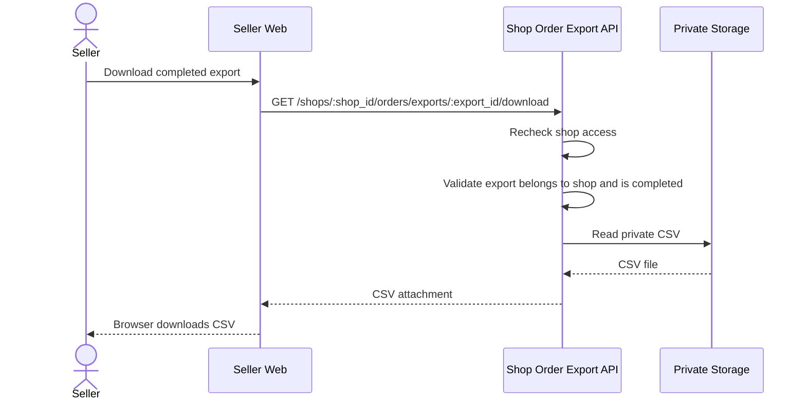

# Download Flow

See the [design](../README.md) and [flow index](../flow.md).

```mermaid
sequenceDiagram
    actor Seller
    participant Web as Seller Web
    participant API as Shop Order Export API
    participant Storage as Private Storage

    Seller->>Web: Download completed export
    Web->>API: GET /shops/:shop_id/orders/exports/:export_id/download
    API->>API: Recheck shop access
    API->>API: Validate export belongs to shop and is completed
    API->>Storage: Read private CSV
    Storage-->>API: CSV file
    API-->>Web: CSV attachment
    Web-->>Seller: Browser downloads CSV
```

The completed in-app notification stores enough routing data for the seller to download the same export later.
