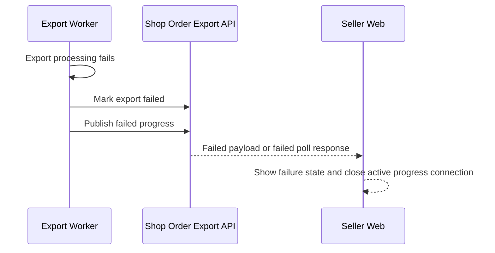

# Failure Flow

See the [design](../README.md) and [flow index](../flow.md).

```mermaid
sequenceDiagram
    participant Worker as Export Worker
    participant API as Shop Order Export API
    participant Web as Seller Web

    Worker->>Worker: Export processing fails
    Worker->>API: Mark export failed
    Worker->>API: Publish failed progress
    API-->>Web: Failed payload or failed poll response
    Web-->>Web: Show failure state and close active progress connection
```

Temporary files are removed whether export processing succeeds or fails.
