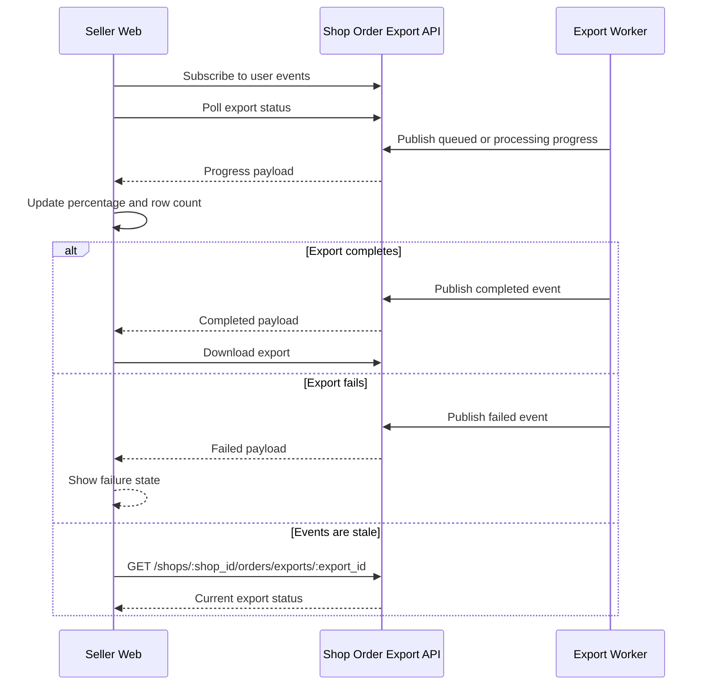

# Progress Flow

See the [design](../README.md) and [flow index](../flow.md).

```mermaid
sequenceDiagram
    participant Web as Seller Web
    participant API as Shop Order Export API
    participant Worker as Export Worker

    Web->>API: Subscribe to user events
    Web->>API: Poll export status
    Worker->>API: Publish queued or processing progress
    API-->>Web: Progress payload
    Web->>Web: Update percentage and row count

    alt Export completes
        Worker->>API: Publish completed event
        API-->>Web: Completed payload
        Web->>API: Download export
    else Export fails
        Worker->>API: Publish failed event
        API-->>Web: Failed payload
        Web-->>Web: Show failure state
    else Events are stale
        Web->>API: GET /shops/:shop_id/orders/exports/:export_id
        API-->>Web: Current export status
    end
```

The seller app uses events and polling together so progress can continue when one delivery path is unavailable.
