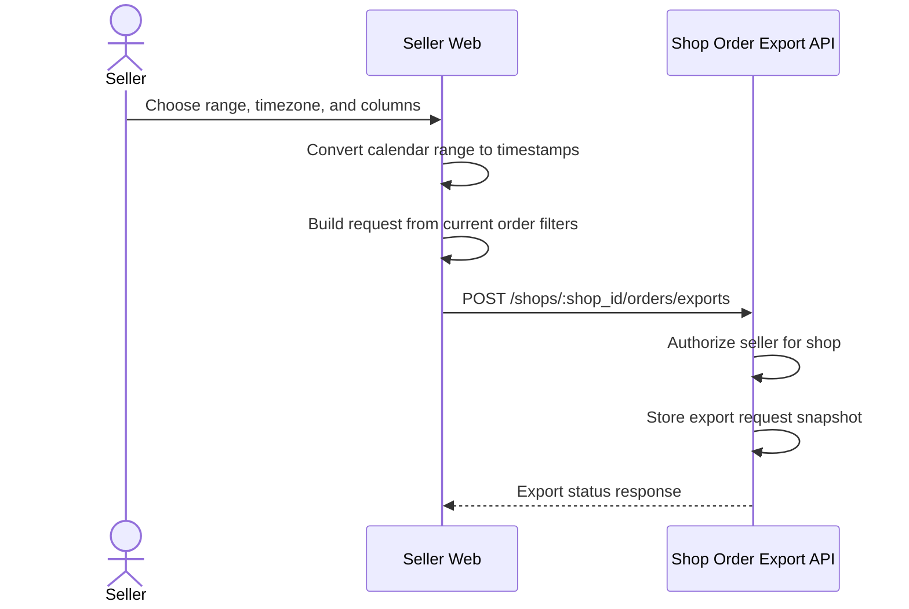

# Start Export

See the [design](../README.md) and [flow index](../flow.md).

The request includes existing order filters, export metadata, and either the default column preset or selected custom column IDs.
