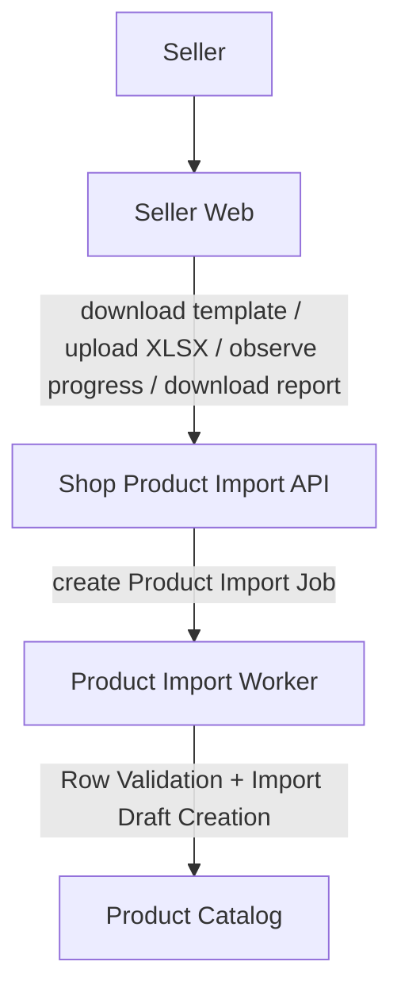

# Import Product Design

## Overview

Product Import lets a shop manager upload an XLSX file and create product drafts in bulk.

V1 is intentionally narrow: it creates draft, non-variant products only, validates each Import Row independently, and returns an Import Report CSV with created and failed outcomes.

Product Import is seller-owned catalog maintenance. It is not a product publishing workflow, product update workflow, Image Import pipeline, category management tool, or marketplace-wide catalog ingestion system.

## Goals

- Let sellers create many product drafts from a backend-generated Import Template.
- Keep product business rules authoritative on the API.
- Give sellers fast browser-side Import Preview feedback before Import Upload.
- Process imports asynchronously so upload requests do not perform long-running work.
- Produce an Import Report that explains created and failed rows.
- Preserve existing product invariants by using current product application use cases.

## Scope

In scope for v1:

- XLSX Import Template download.
- XLSX Import Upload from the seller product import page.
- Browser Import Preview using SheetJS.
- Backend XLSX Parser behavior using SheetJS.
- Template Validation before queueing import work.
- Row Validation during import processing.
- Draft-only Import Draft Creation.
- One Import Row creates one non-variant product draft.
- Import Report CSV download.
- Active import progress and result UI.

Out of scope for v1:

- CSV upload.
- Product publishing during import.
- Updating existing products by SKU.
- Variants or multiple inventory rows per product.
- Image Import.
- Creating missing categories.
- Import History UI.
- Import Completion Notification.
- Column mapping.
- Import options such as skip, update, or create duplicate.

## System Context

## System Context

## Template Contract

The Import Template is generated by the backend from `GET /shops/:shop_id/products/imports/template`.

Required sheets:

- `Metadata`
- `Products`

Optional sheet:

- `Instructions`

The Metadata Sheet declares `template_version = product-import-v1`. The Products Sheet contains row 1 headers.

Required columns:

- `title`
- `description`
- `category_path`
- `price`
- `stock`

Optional columns:

- `sku`
- `original_price`
- `is_digital`
- `who_made`
- `non_taxable`

Backend-derived fields:

- `currency = shop.currency`
- `variant_type = none`
- `state = draft`

## State Model

Product Import Job statuses:

- `queued`
- `processing`
- `completed`
- `failed`

Row outcomes:

- `created`
- `failed`

Completed Import means the job finished processing all parsed rows. It does not mean every row succeeded.

Job summary fields:

- `total_rows`
- `processed_rows`
- `created_rows`
- `failed_rows`
- `unprocessed_rows`

## Key Invariants

- Import Authorization uses the same boundary as seller product management.
- The frontend Import Preview is advisory; backend Template Validation and Row Validation are authoritative.
- Browser Import Preview performs lightweight advisory validation only on displayed preview rows.
- Browser Import Preview must not scan every product row for row-level validation.
- The frontend uploads the original XLSX, not parsed SheetJS JSON.
- Template Validation failures stop the whole import before row creation.
- Row Validation failures affect only the invalid Import Row.
- SKU Conflict fails affected rows instead of updating existing products.
- Valid rows create drafts through existing product application use cases, not direct persistence writes.
- Import Request Idempotency prevents duplicate Product Import Jobs.
- Row Import Attempt tracking prevents duplicate draft creation when worker processing is retried.
- Import Source Files and Import Reports are private artifacts exposed only through authorized API endpoints.

## Constraints

- Upload format is `.xlsx` only.
- Maximum XLSX size is 10 MB.
- Maximum product rows per import is 1,000.
- Browser preview shows at most 10 product rows.
- Browser preview validates at most the displayed preview rows.
- Browser row-count checks may use worksheet metadata before preview extraction.
- Formula Cells are unsupported.
- Source XLSX files are retained for 7 days.
- CSV reports are retained for 30 days.

## Related Documents

- [Flow](flow.md)
- [Import Products Spec](../import-product-spec.md)
- [ADR-004: Use Draft-Only Asynchronous XLSX Product Import](../../../apps/api/api/docs/adrs/004-product-xlsx-import.md)
