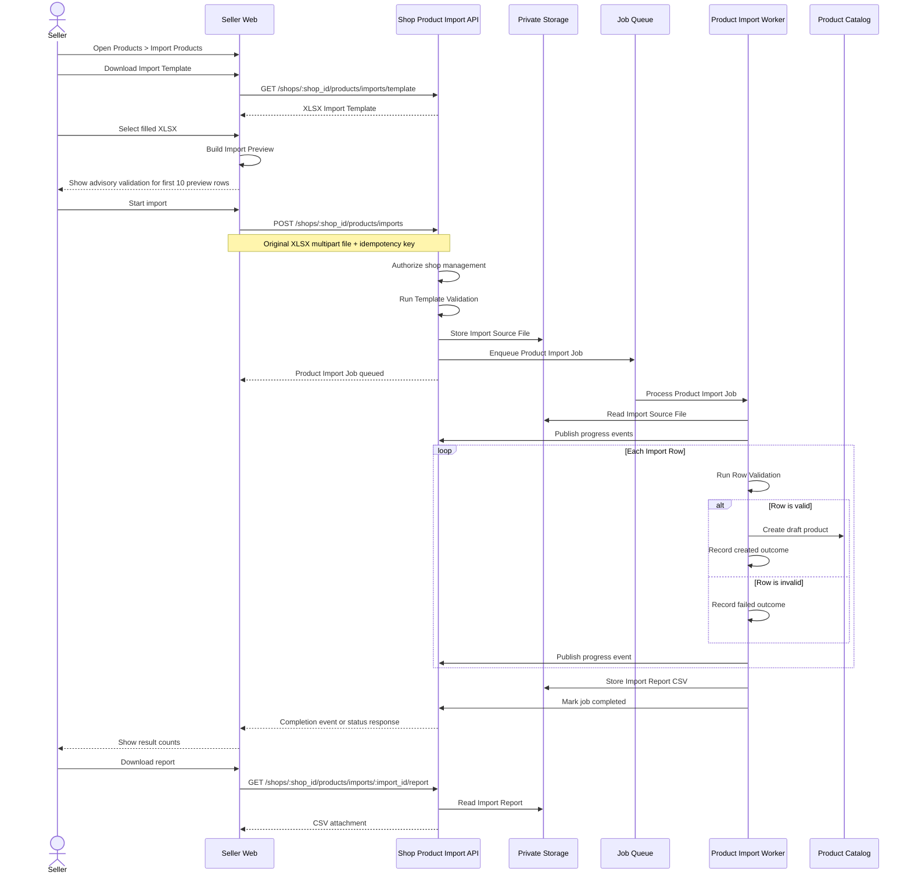
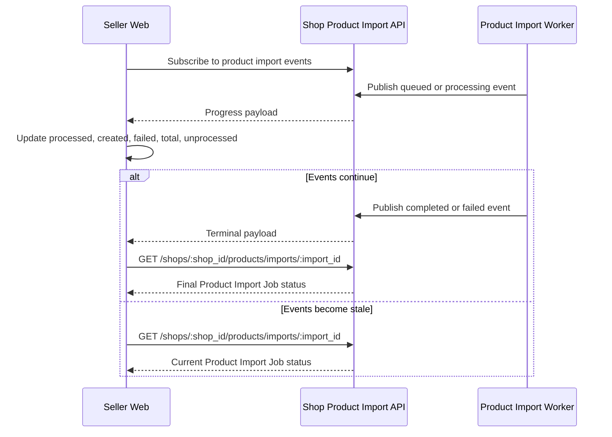
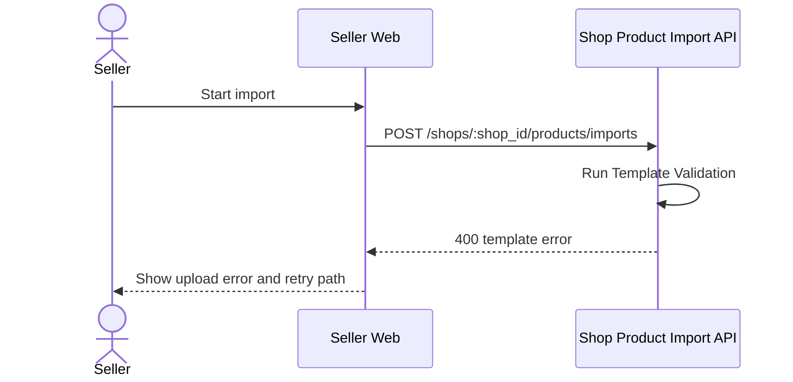
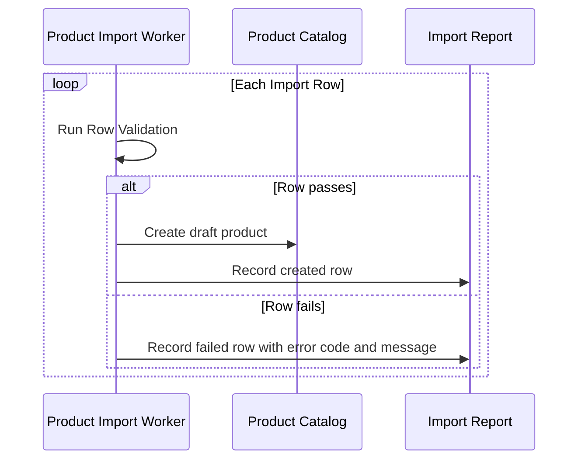
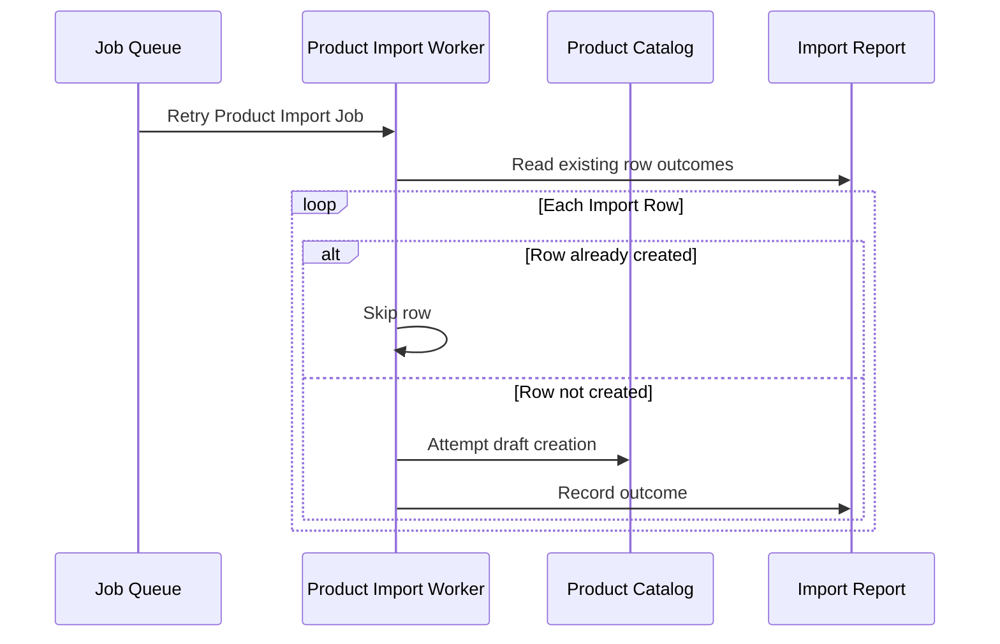

# Import Product Flow

## Main Flow

## Progress Flow

## Template Validation Failure

Template Validation failures stop the import before a Product Import Job creates rows.

## Row Failure

Row Validation failures affect only the invalid Import Row. A Completed Import can still include failed rows.

## Retry Flow

Worker retries must not recreate drafts for rows already recorded as created.
