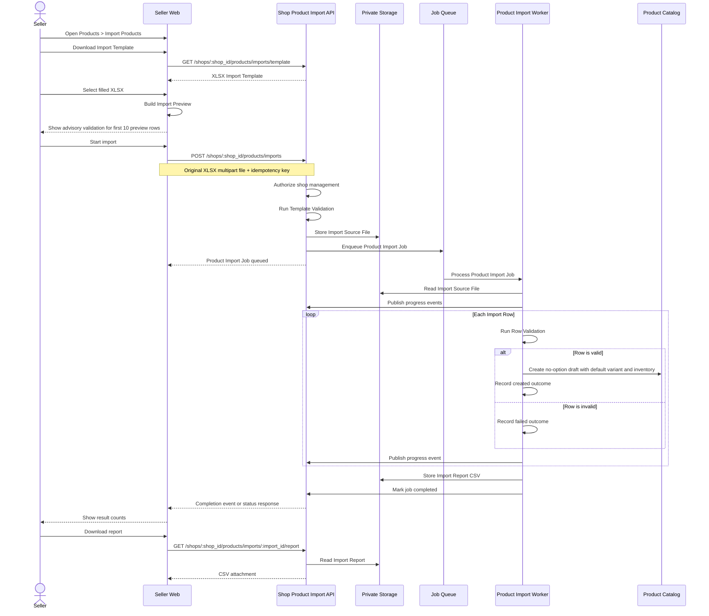

# Main Flow

See the [design](../README.md) and [flow index](../flow.md).

Each successful row creates one Default Product Variant with zero selections and one Inventory Item containing the row's reviewed price, count, and optional SKU. The normalized model does not add option-matrix columns to the XLSX template. See [Product Variant Design](../../product-variant-design/README.md).
