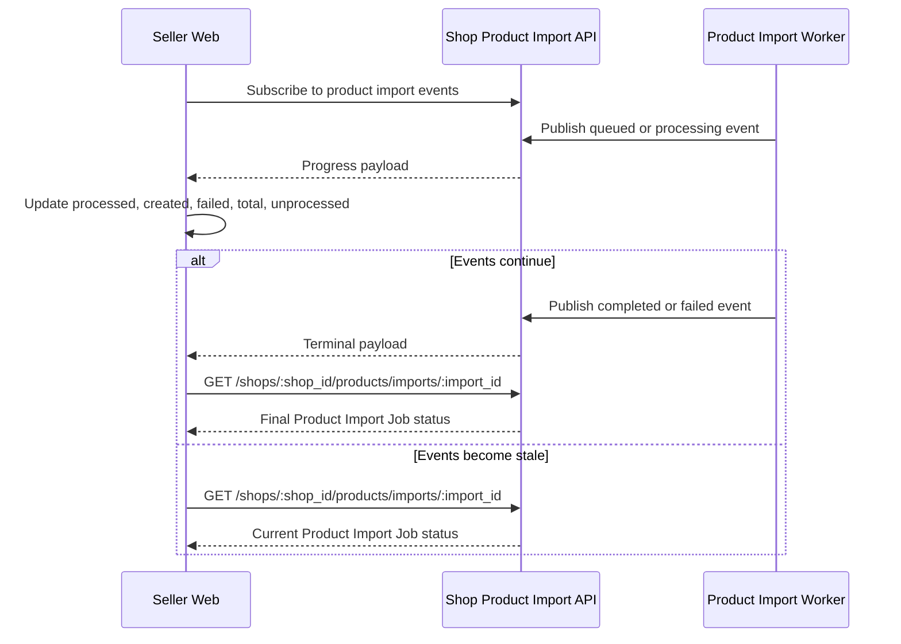

# Progress Flow

See the [design](../README.md) and [flow index](../flow.md).

```mermaid
sequenceDiagram
    participant Web as Seller Web
    participant API as Shop Product Import API
    participant Worker as Product Import Worker

    Web->>API: Subscribe to product import events
    Worker->>API: Publish queued or processing event
    API-->>Web: Progress payload
    Web->>Web: Update processed, created, failed, total, unprocessed

    alt Events continue
        Worker->>API: Publish completed or failed event
        API-->>Web: Terminal payload
        Web->>API: GET /shops/:shop_id/products/imports/:import_id
        API-->>Web: Final Product Import Job status
    else Events become stale
        Web->>API: GET /shops/:shop_id/products/imports/:import_id
        API-->>Web: Current Product Import Job status
    end
```
