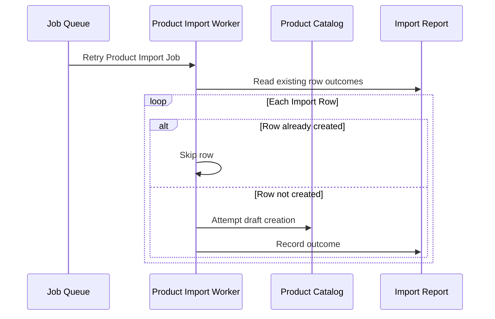

# Retry Flow

See the [design](../README.md) and [flow index](../flow.md).

```mermaid
sequenceDiagram
    participant Queue as Job Queue
    participant Worker as Product Import Worker
    participant Catalog as Product Catalog
    participant Report as Import Report

    Queue->>Worker: Retry Product Import Job
    Worker->>Report: Read existing row outcomes
    loop Each Import Row
        alt Row already created
            Worker->>Worker: Skip row
        else Row not created
            Worker->>Catalog: Attempt draft creation
            Worker->>Report: Record outcome
        end
    end
```

Worker retries must not recreate drafts for rows already recorded as created.
