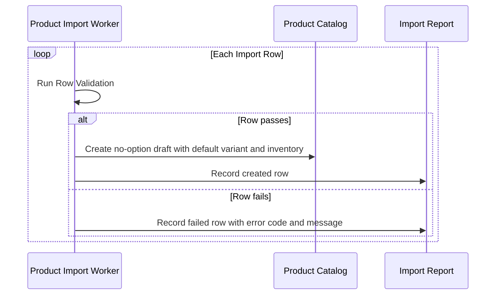

# Row Failure

See the [design](../README.md) and [flow index](../flow.md).

```mermaid
sequenceDiagram
    participant Worker as Product Import Worker
    participant Catalog as Product Catalog
    participant Report as Import Report

    loop Each Import Row
        Worker->>Worker: Run Row Validation
        alt Row passes
            Worker->>Catalog: Create no-option draft with default variant and inventory
            Worker->>Report: Record created row
        else Row fails
            Worker->>Report: Record failed row with error code and message
        end
    end
```

Row Validation failures affect only the invalid Import Row. A Completed Import can still include failed rows.
