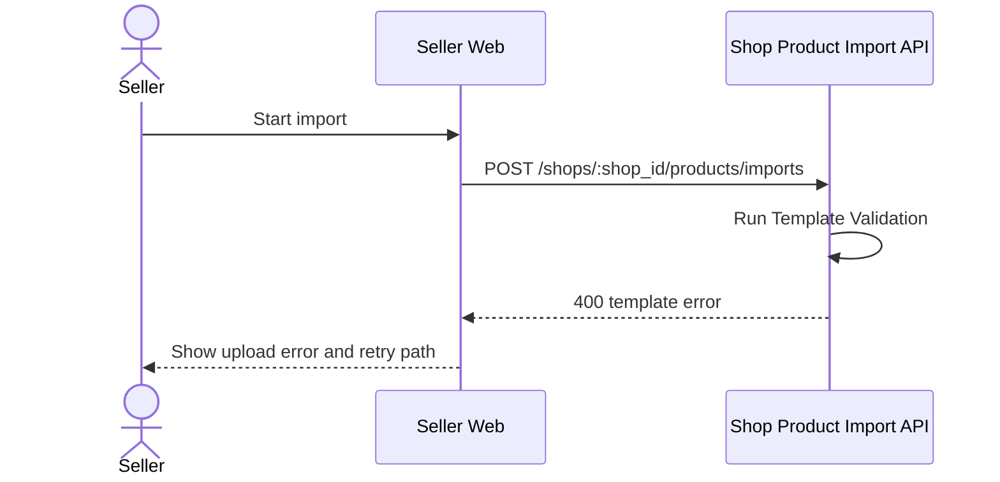

# Template Validation Failure

See the [design](../README.md) and [flow index](../flow.md).

```mermaid
sequenceDiagram
    actor Seller
    participant Web as Seller Web
    participant API as Shop Product Import API

    Seller->>Web: Start import
    Web->>API: POST /shops/:shop_id/products/imports
    API->>API: Run Template Validation
    API-->>Web: 400 template error
    Web-->>Seller: Show upload error and retry path
```

Template Validation failures stop the import before a Product Import Job creates rows.
