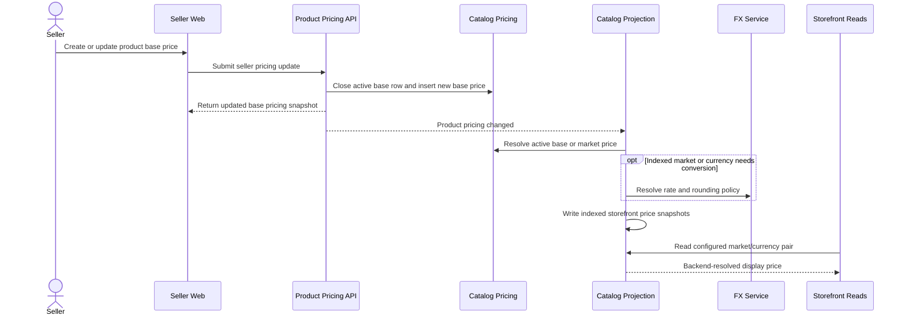
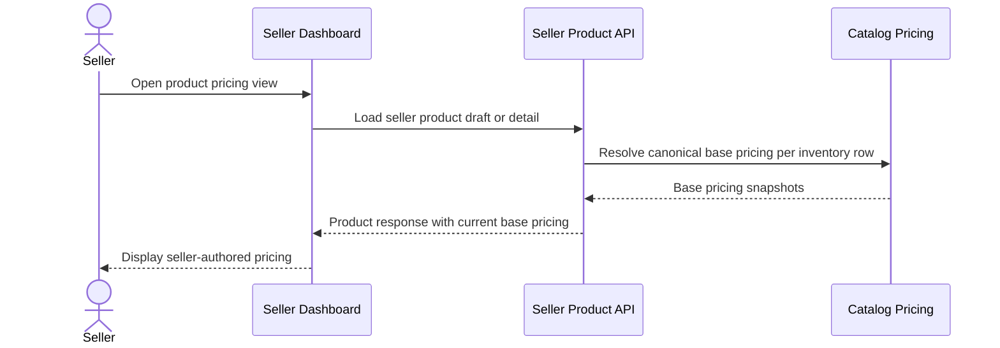
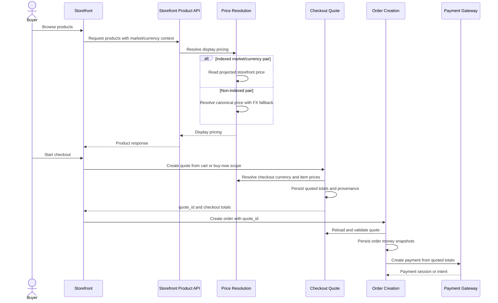
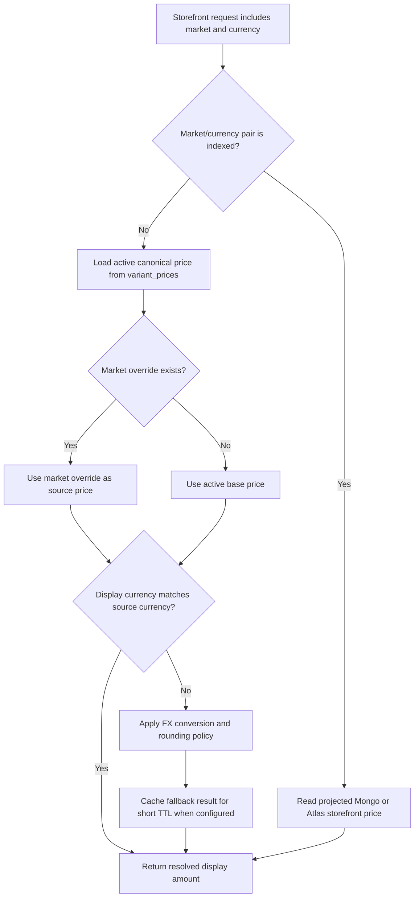

# Multi-Currency Pricing Flows

This document captures end-to-end lifecycle examples for the current multi-currency pricing model.

For the target model, invariants, and data design, see [README.md](README.md).

## Flow 1: Seller creates product pricing for storefront display

Summary:

- seller authors canonical base pricing
- the current seller pricing write API does not expose market override creation
- catalog projection precomputes storefront pricing for configured indexed market/currency pairs
- backend decides whether to use an existing market override or base-price conversion
- storefront receives backend-resolved display pricing

## Flow 2: Seller views product pricing in seller dashboard

Summary:

- seller dashboard currently exposes the base pricing snapshot used by the product draft summary
- market override rows may exist in persistence, but they are not surfaced through the normal seller pricing write/read flow today

## Flow 3: Buyer creates checkout from storefront

Summary:

- storefront display currency may differ from checkout currency
- configured indexed market/currency pairs are served from projected Mongo/Atlas pricing documents
- non-indexed pairs fall back to live backend resolution from canonical prices, with short-lived caching
- transactional pricing becomes authoritative at quote creation
- payment uses persisted quote amounts and does not reprice
- orders currently keep quote linkage in `payment_details.quote_id`

## Indexed Versus Fallback Price Resolution

Summary:

- indexed pairs use precomputed storefront price documents for read performance
- fallback pairs continue to resolve from canonical `variant_prices`
- market override rows win over base-price conversion when present
- FX conversion is a browsing concern until quote creation persists transactional amounts
