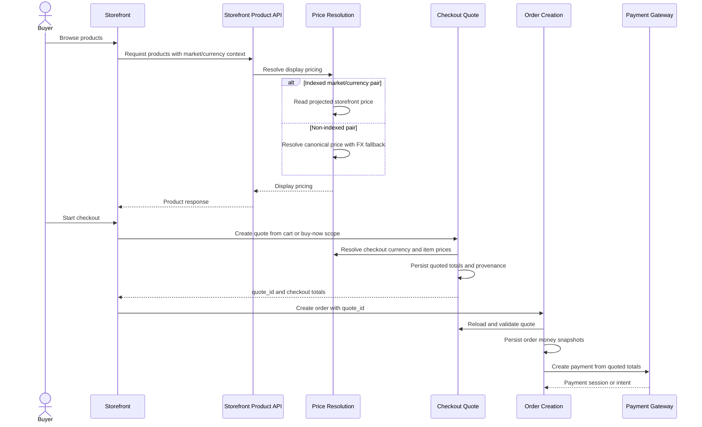

# Buyer Creates Checkout From Storefront

This flow describes how storefront display pricing becomes authoritative transactional pricing during checkout.

Summary:

- storefront display currency may differ from checkout currency
- configured indexed market/currency pairs are served from projected Mongo/Atlas pricing documents
- non-indexed pairs fall back to live backend resolution from canonical prices, with short-lived caching
- transactional pricing becomes authoritative at quote creation
- payment uses persisted quote amounts and does not reprice
- orders currently keep quote linkage in `payment_details.quote_id`
