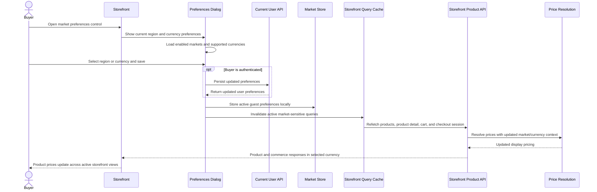

# Buyer Updates Storefront Currency Preferences

This flow describes how buyer region and currency preferences change active storefront pricing context.

Summary:

- buyer can change region and currency from the storefront preferences dialog
- available currencies are constrained by the selected enabled market
- authenticated buyers persist preferences through the current user API
- guest preferences are stored locally and become the active storefront market context
- active market-sensitive storefront queries are invalidated after save
- refetched products, product detail, cart, and checkout session data resolve prices with the selected currency
- product display prices update across active storefront views after the refetch completes
