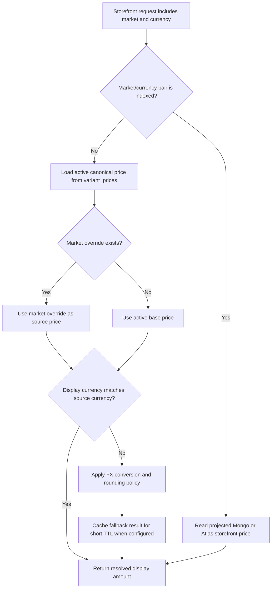

# Indexed Versus Fallback Price Resolution

This flow describes how storefront price resolution chooses between projected indexed prices and canonical fallback resolution.

Summary:

- indexed pairs use precomputed storefront price documents for read performance
- fallback pairs continue to resolve from canonical `variant_prices`
- market override rows win over base-price conversion when present
- FX conversion is a browsing concern until quote creation persists transactional amounts
