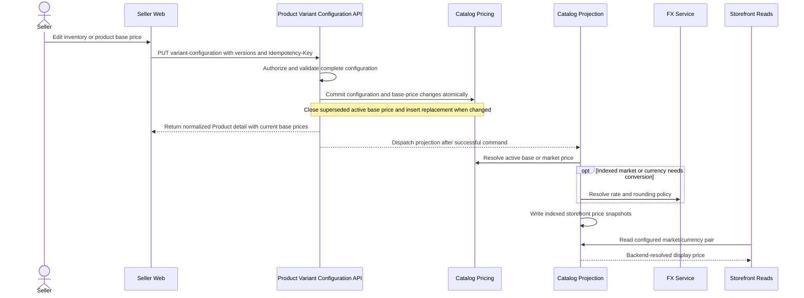

# Seller Creates Product Pricing For Storefront Display

This flow describes how an existing Product's seller-authored base pricing becomes backend-resolved storefront display pricing. Product creation uses its creation workflow; later seller inventory and base-price edits use the complete Product Variant Configuration command.

Summary:

- seller authors canonical base pricing
- each priced Inventory Item references a Product Variant, including the zero-selection default
- configuration edits use `PUT /v1/shops/:shop_id/products/:product_id/variant-configuration`; this is not a separate per-row pricing mutation endpoint
- rejected configuration edits must not partially apply their price changes
- the current seller pricing write API does not expose market override creation
- catalog projection precomputes storefront pricing for configured indexed market/currency pairs
- backend decides whether to use an existing market override or base-price conversion
- storefront receives backend-resolved display pricing

See [Product Variant Design](../../product-variant-design/README.md) for identity, replacement inventory, version conflicts, and retry semantics. Canonical price selection, market overrides, and FX resolution remain owned by [Multi-Currency Pricing](../README.md).
