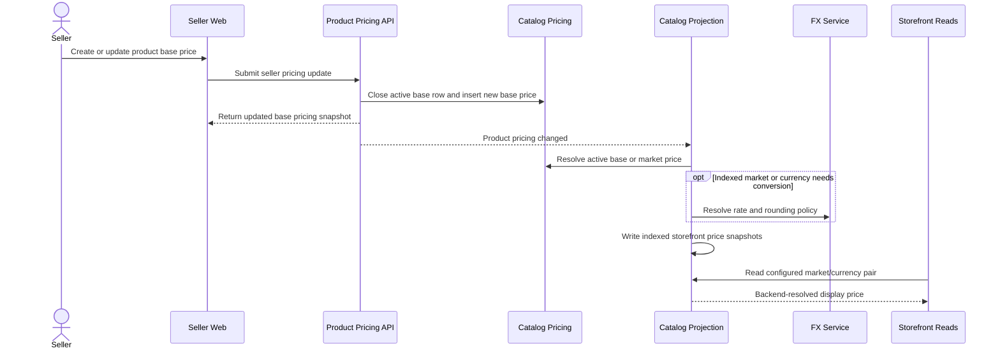

# Seller Creates Product Pricing For Storefront Display

This flow describes how seller-authored base pricing becomes backend-resolved storefront display pricing.

Summary:

- seller authors canonical base pricing
- the current seller pricing write API does not expose market override creation
- catalog projection precomputes storefront pricing for configured indexed market/currency pairs
- backend decides whether to use an existing market override or base-price conversion
- storefront receives backend-resolved display pricing
