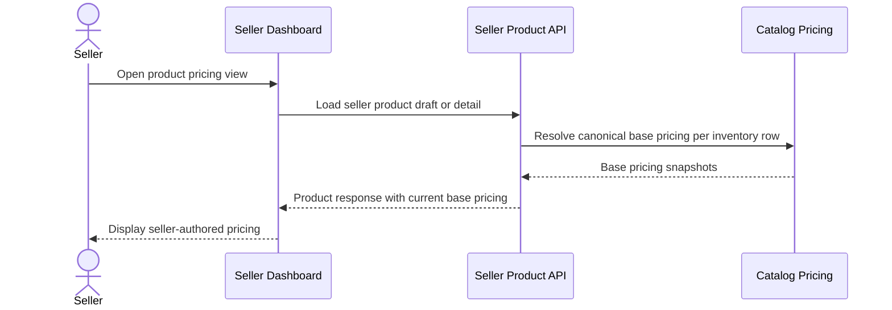

# Seller Views Product Pricing In Seller Dashboard

This flow describes how seller dashboard reads show seller-authored base pricing.

Summary:

- seller dashboard currently exposes the base pricing snapshot used by the product draft summary
- market override rows may exist in persistence, but they are not surfaced through the normal seller pricing write/read flow today
